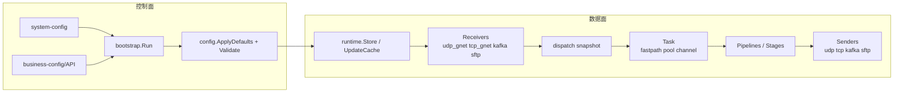
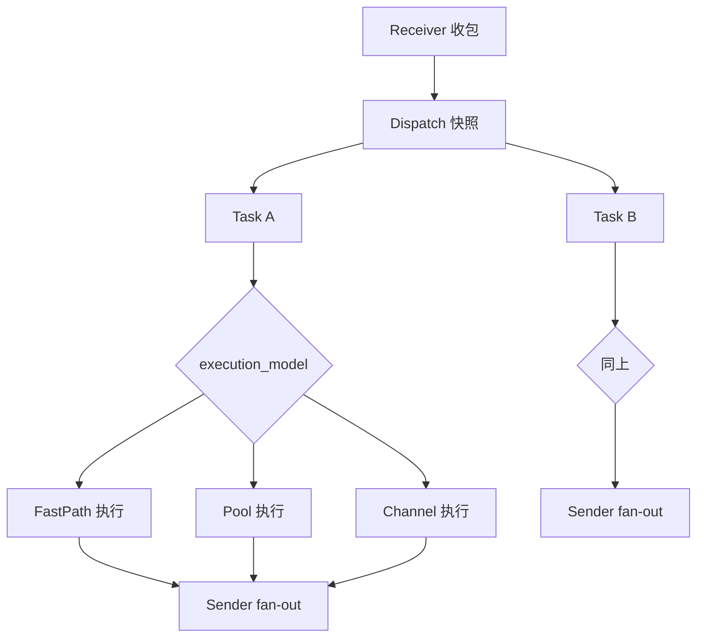

# forward-stub

`forward-stub` 是一个基于 Go 的协议转发引擎，面向高吞吐、低延迟、可热更新的在线转发场景。系统将数据处理统一抽象为 **receiver -> task(pipeline + sender)**，通过可配置编排完成多协议接入、处理和分发。

## 核心能力

- 基于 `receiver -> pipeline -> sender` 的任务编排模型，支持 1:N / N:M 拓扑。
- 支持 `UDP/TCP/Kafka/SFTP` 收发与协议转换。
- 提供 `fastpath / pool / channel` 三种执行模型，按吞吐、延迟、顺序性需求切换。
- 支持业务配置热更新（文件变更监听 + 信号触发），系统配置保持稳定基线。
- runtime 使用 dispatch 快照（`receiver -> tasks`）降低热路径锁竞争。
- 内置 payload 内存复用与有界队列，控制 GC 与回压行为。
- 支持结构化日志、流量聚合统计、payload 摘要日志。
- 可选开启 pprof 诊断接口，支持运行时性能分析。
- 提供 `cmd/bench` 压测工具与 sweep 配置，便于持续性能回归。

## 系统总体架构



## 核心处理流程



## 支持协议与典型场景

| 方向 | 类型 | 典型用途 |
|---|---|---|
| Receiver | `udp_gnet` / `tcp_gnet` | 高并发网络入口（设备流、网关流）。 |
| Receiver | `kafka` | 从消息总线消费并转发。 |
| Receiver | `sftp` | 文件目录轮询读取，转为分块流。 |
| Sender | `udp_unicast` / `udp_multicast` / `tcp_gnet` | 实时网络分发到下游服务。 |
| Sender | `kafka` | 转发到主题做解耦与削峰。 |
| Sender | `sftp` | 流转文件落地与交换。 |

## Quick Start

### 1) 编译

```bash
make build
```

或直接：

```bash
go build -mod=vendor -o bin/forward-stub .
```

### 2) 启动（推荐双配置文件）

```bash
./bin/forward-stub \
  -system-config ./configs/system.example.json \
  -business-config ./configs/business.example.json
```

### 3) 启动（兼容 legacy 单文件）

```bash
go run . -config ./configs/example.json
```

### 4) 快速压测入口

```bash
go run ./cmd/bench -config ./configs/bench.example.json
```

## 配置入口说明（简要）

- 推荐双文件：
  - `system-config`：`control`、`logging`、`business_defaults`（系统级基线）。
  - `business-config`：`version`、`receivers`、`senders`、`pipelines`、`tasks`（业务拓扑，可热更新）。
- 启动参数：`-system-config` + `-business-config`（或 legacy `-config`）。
- 当 `control.api` 非空时，进程会从远端拉取 `business-config`。

详细字段与默认值请见 [docs/configuration.md](docs/configuration.md)。

## 部署入口说明（简要）

- **本地运行**：`make build` 后直接执行二进制。
- **Docker**：使用项目 `Dockerfile` 构建镜像，`make docker-build` / `make docker-run`。
- **Kubernetes**：使用 `deploy/k8s/` 的 kustomize 清单，或 `scripts/k8s-deploy.sh apply`。

详见 [docs/deployment.md](docs/deployment.md)。

## 监控与调试入口

- 日志：`src/logx` 支持结构化日志 + 滚动文件 + 流量聚合统计。
- payload 观测：receiver/task 支持可控 payload 摘要日志。
- pprof：`control.pprof_port` 开启后提供 `/debug/pprof/*`。
- 压测：`cmd/bench` 支持 UDP/TCP 基准与参数 sweep。

详见 [docs/operations.md](docs/operations.md) 与 [docs/performance.md](docs/performance.md)。

## 项目结构概览

```text
cmd/bench/         压测与性能回归工具
configs/           system/business/bench 示例配置
deploy/k8s/        Kubernetes 清单（kustomize）
docs/              架构、配置、部署、运维、性能与排障文档
scripts/           构建、打包、部署辅助脚本
src/bootstrap/     启动参数、信号处理、配置监听、pprof 启停
src/config/        配置模型、默认值、校验、双文件合并
src/runtime/       pipeline 编译、热更新、dispatch 快照
src/task/          任务执行模型（fastpath/pool/channel）
src/receiver/      接收端实现（UDP/TCP/Kafka/SFTP）
src/sender/        发送端实现（UDP/TCP/Kafka/SFTP）
src/pipeline/      stage 实现与处理链
src/logx/          日志与流量统计
```

## 文档索引

- [docs/architecture.md](docs/architecture.md)：系统定位、模块关系、控制面/数据面划分。
- [docs/execution-model.md](docs/execution-model.md)：三种执行模型与调度/回压分析。
- [docs/configuration.md](docs/configuration.md)：配置体系、默认值、校验、热更新边界。
- [docs/receivers-and-senders.md](docs/receivers-and-senders.md)：协议收发抽象与组合模式。
- [docs/pipeline.md](docs/pipeline.md)：stage 模型、类型、执行语义与路由 stage。
- [docs/deployment.md](docs/deployment.md)：本地 / Docker / Kubernetes 部署入口。
- [docs/operations.md](docs/operations.md)：启动停止、巡检、日志、pprof 与常用命令。
- [docs/performance.md](docs/performance.md)：性能设计点、bench 用法、指标建议。
- [docs/troubleshooting.md](docs/troubleshooting.md)：典型故障定位路径与命令示例。
- [docs/roadmap.md](docs/roadmap.md)：架构局限、演进建议与文档维护计划。

历史实验与评审记录：

- `docs/perf_extreme_sweep_*.md` / `*.json`
- `docs/code_review_2026-03-11.md`
- `docs/udp_optimization_review_2026-03-11.md`
