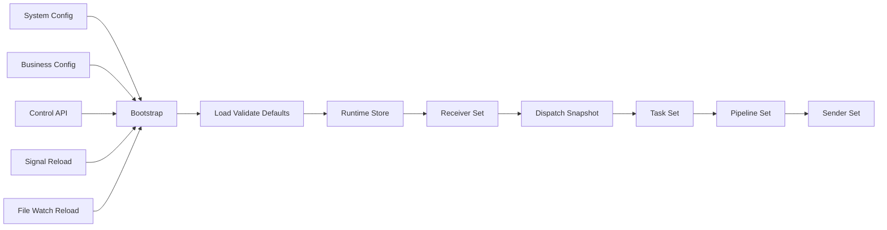
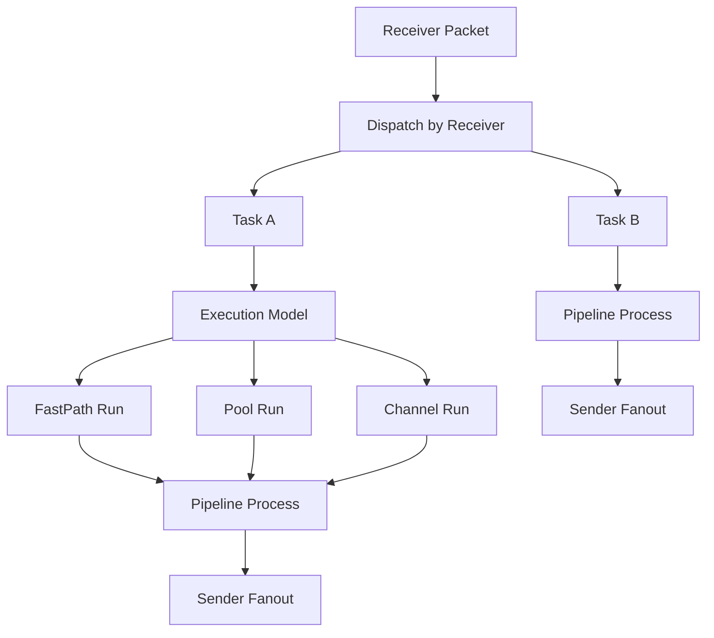

# forward-stub

`forward-stub` 是一个面向高吞吐、低延迟、可热更新场景的 Go 转发引擎。系统把协议接入、处理、分发统一抽象为 `receiver -> task(pipeline + sender)`，通过配置把 UDP/TCP/Kafka/SFTP 组合成可运行的数据转发链路。

## 1. 项目简介

本项目解决的核心问题：

- 将多协议输入统一收敛为内部 `packet.Packet` 数据模型。
- 通过可编排 `task` 把处理逻辑和下游分发策略配置化。
- 在不停机前提下更新业务拓扑（receiver/sender/pipeline/task）。
- 提供可观测入口（日志、流量统计、pprof、bench）支持运维与性能回归。

## 2. 核心能力

- 支持 `udp_gnet`、`tcp_gnet`、`kafka`、`sftp` 四类 receiver。
- 支持 `udp_unicast`、`udp_multicast`、`tcp_gnet`、`kafka`、`sftp` 五类 sender。
- 内置 `match_offset_bytes`、`replace_offset_bytes`、`mark_as_file_chunk`、`clear_file_meta`、`route_offset_bytes_sender` stage。
- `task` 支持 `fastpath`、`pool`、`channel` 三种执行模型。
- runtime 支持 dispatch 快照分发，降低热路径锁竞争。
- 支持 system/business 双配置模式，兼容 legacy 单文件模式。
- 支持 business 配置热更新（文件监听 + 信号触发）。
- 支持 payload 复用、队列边界和回压控制。

## 3. 系统总体架构图



## 4. 核心处理流程图



## 5. 快速开始

### 5.1 编译

```bash
make build
```

或直接：

```bash
go build -mod=vendor -o bin/forward-stub .
```

### 5.2 运行（双配置模式）

```bash
./bin/forward-stub \
  -system-config ./configs/system.example.json \
  -business-config ./configs/business.example.json
```

### 5.3 运行（legacy 单文件模式）

```bash
./bin/forward-stub -config ./configs/example.json
```

### 5.4 压测入口

```bash
go run ./cmd/bench -config ./configs/bench.example.json
```

## 6. 配置体系说明

### 6.1 双配置模式

- `system-config`：系统级配置，包含 `control`、`logging`、`business_defaults`。
- `business-config`：业务拓扑配置，包含 `version`、`receivers`、`senders`、`pipelines`、`tasks`。

### 6.2 单文件模式

- `example.json` 为兼容模式，system 与 business 合并在同一文件。

### 6.3 配置加载顺序

1. `config.ResolveConfigPaths` 解析参数组合。
2. `config.LoadLocalPair` 加载本地 JSON。
3. `SystemConfig.Merge(BusinessConfig)` 合并为运行态 `Config`。
4. `ApplyBusinessDefaults` 与 `ApplyDefaults` 补齐默认值。
5. `Validate` 校验引用关系和协议字段。

## 7. Receiver 配置示例总览

> 每个示例均为可复制 JSON 片段，放入 `business-config.receivers` 下。

### 7.1 udp_gnet

用途：高并发 UDP 接入。

```json
{
  "rx_udp": {
    "type": "udp_gnet",
    "listen": "0.0.0.0:19000",
    "multicore": true,
    "num_event_loop": 8,
    "read_buffer_cap": 1048576,
    "socket_recv_buffer": 1073741824,
    "log_payload_recv": false,
    "payload_log_max_bytes": 256
  }
}
```

### 7.2 tcp_gnet

用途：TCP 长连接接入，支持 framing。

```json
{
  "rx_tcp": {
    "type": "tcp_gnet",
    "listen": "0.0.0.0:19001",
    "frame": "u16be",
    "multicore": true,
    "num_event_loop": 4,
    "socket_recv_buffer": 1073741824
  }
}
```

### 7.3 kafka

用途：消费 Kafka topic 并转发。

```json
{
  "rx_kafka": {
    "type": "kafka",
    "listen": "127.0.0.1:9092",
    "topic": "input-topic",
    "group_id": "forward-stub-group",
    "start_offset": "latest",
    "fetch_min_bytes": 1,
    "fetch_max_bytes": 1048576,
    "fetch_max_wait_ms": 100,
    "username": "kafka-user",
    "password": "kafka-pass",
    "sasl_mechanism": "PLAIN",
    "tls": false,
    "tls_skip_verify": false
  }
}
```

### 7.4 sftp

用途：轮询远端目录并按 chunk 读取文件。

```json
{
  "rx_sftp": {
    "type": "sftp",
    "listen": "127.0.0.1:22",
    "username": "demo",
    "password": "demo",
    "remote_dir": "/input",
    "poll_interval_sec": 3,
    "chunk_size": 65536,
    "host_key_fingerprint": "SHA256:W5M5Qf3jQ8jD8I2LqzY9zT6QfPj1O9g3k8xw0Jm9r3A"
  }
}
```

## 8. Sender 配置示例总览

> 每个示例均为可复制 JSON 片段，放入 `business-config.senders` 下。

### 8.1 udp_unicast

```json
{
  "tx_udp": {
    "type": "udp_unicast",
    "local_ip": "0.0.0.0",
    "local_port": 20000,
    "remote": "127.0.0.1:21000",
    "concurrency": 8,
    "socket_send_buffer": 1073741824
  }
}
```

### 8.2 udp_multicast

```json
{
  "tx_mcast": {
    "type": "udp_multicast",
    "local_ip": "0.0.0.0",
    "local_port": 20001,
    "remote": "239.0.0.10:21001",
    "iface": "eth0",
    "ttl": 16,
    "loop": false,
    "concurrency": 8,
    "socket_send_buffer": 1073741824
  }
}
```

### 8.3 tcp_gnet

```json
{
  "tx_tcp": {
    "type": "tcp_gnet",
    "remote": "127.0.0.1:21002",
    "frame": "u16be",
    "concurrency": 4,
    "socket_send_buffer": 1073741824
  }
}
```

### 8.4 kafka

```json
{
  "tx_kafka": {
    "type": "kafka",
    "remote": "127.0.0.1:9092",
    "topic": "output-topic",
    "acks": -1,
    "linger_ms": 5,
    "batch_max_bytes": 1048576,
    "compression": "lz4",
    "username": "kafka-user",
    "password": "kafka-pass",
    "sasl_mechanism": "PLAIN",
    "tls": false,
    "tls_skip_verify": false
  }
}
```

### 8.5 sftp

```json
{
  "tx_sftp": {
    "type": "sftp",
    "remote": "127.0.0.1:22",
    "username": "demo",
    "password": "demo",
    "remote_dir": "/output",
    "temp_suffix": ".tmp",
    "host_key_fingerprint": "SHA256:W5M5Qf3jQ8jD8I2LqzY9zT6QfPj1O9g3k8xw0Jm9r3A"
  }
}
```

## 9. Pipeline Stage 配置示例总览

> 每个示例均为可复制 JSON 片段，放入 `business-config.pipelines` 下。

### 9.1 match_offset_bytes

```json
{
  "pipe_match": [
    {
      "type": "match_offset_bytes",
      "offset": 0,
      "hex": "aabb"
    }
  ]
}
```

### 9.2 replace_offset_bytes

```json
{
  "pipe_replace": [
    {
      "type": "replace_offset_bytes",
      "offset": 2,
      "hex": "ccdd"
    }
  ]
}
```

### 9.3 mark_as_file_chunk

```json
{
  "pipe_mark_file": [
    {
      "type": "mark_as_file_chunk",
      "path": "/auto/out.bin",
      "bool": true
    }
  ]
}
```

### 9.4 clear_file_meta

```json
{
  "pipe_clear_file": [
    {
      "type": "clear_file_meta"
    }
  ]
}
```

### 9.5 route_offset_bytes_sender

```json
{
  "pipe_route_sender": [
    {
      "type": "route_offset_bytes_sender",
      "offset": 0,
      "cases": {
        "01": "tx_udp",
        "02": "tx_tcp"
      },
      "default_sender": "tx_kafka"
    }
  ]
}
```

## 10. Task 执行模型配置示例总览

> 每个示例均为可复制 JSON 片段，放入 `business-config.tasks` 下。

### 10.1 fastpath

```json
{
  "task_fastpath": {
    "receivers": ["rx_udp"],
    "pipelines": ["pipe_match"],
    "senders": ["tx_udp"],
    "execution_model": "fastpath",
    "queue_size": 2048,
    "channel_queue_size": 2048,
    "log_payload_send": false,
    "payload_log_max_bytes": 256
  }
}
```

### 10.2 pool

```json
{
  "task_pool": {
    "receivers": ["rx_tcp"],
    "pipelines": ["pipe_replace"],
    "senders": ["tx_tcp", "tx_kafka"],
    "execution_model": "pool",
    "pool_size": 2048,
    "queue_size": 4096,
    "channel_queue_size": 4096,
    "log_payload_send": false,
    "payload_log_max_bytes": 256
  }
}
```

### 10.3 channel

```json
{
  "task_channel": {
    "receivers": ["rx_kafka"],
    "pipelines": ["pipe_mark_file"],
    "senders": ["tx_sftp"],
    "execution_model": "channel",
    "pool_size": 1024,
    "queue_size": 1024,
    "channel_queue_size": 1024,
    "log_payload_send": false,
    "payload_log_max_bytes": 256
  }
}
```

## 11. 配置组合方式说明

### 11.1 典型组合一：UDP 输入到 TCP 输出

- receiver：`rx_udp`
- pipeline：`pipe_match + pipe_replace`
- sender：`tx_tcp`
- task：`execution_model=pool`

### 11.2 典型组合二：Kafka 输入到 SFTP 输出

- receiver：`rx_kafka`
- pipeline：`pipe_mark_file`
- sender：`tx_sftp`
- task：`execution_model=channel`

### 11.3 典型组合三：路由分发

- pipeline 使用 `route_offset_bytes_sender`
- task 的 sender 列表必须包含 route 命中的 sender 名称
- route 未命中时使用 `default_sender`

## 12. configs 示例文件说明

`configs/` 保留三份标准配置：

- `configs/system.example.json`：双配置模式中的 system 文件。
- `configs/business.example.json`：双配置模式中的 business 文件。
- `configs/example.json`：legacy 单文件模式示例。

关系说明：

- `system.example.json + business.example.json` 合并后语义等价于 `example.json` 的核心字段组合。
- 新部署建议优先双配置模式，便于控制 system 与 business 的变更边界。

## 13. docs 文档索引

- `docs/architecture.md`：总体架构、模块边界、设计目标。
- `docs/runtime-and-lifecycle.md`：启动、构建、热更新、关闭流程。
- `docs/execution-model.md`：fastpath/pool/channel 深度对比。
- `docs/configuration.md`：配置机制、默认值、校验策略、影响范围。
- `docs/receivers-and-senders.md`：收发抽象、协议差异、组合模式。
- `docs/pipeline.md`：stage 语义、组合策略、路由行为。
- `docs/task-and-dispatch.md`：dispatch 快照、task 实例化与调度路径。
- `docs/deployment.md`：本地、Docker、Kubernetes 部署。
- `docs/operations.md`：运维操作手册与巡检建议。
- `docs/observability.md`：日志、流量统计、pprof、bench 观测方法。
- `docs/performance.md`：性能设计点、压测方法、优化路径。
- `docs/troubleshooting.md`：故障类型与可操作排查路径。
- `docs/roadmap.md`：局限、演进方向、文档维护计划。
