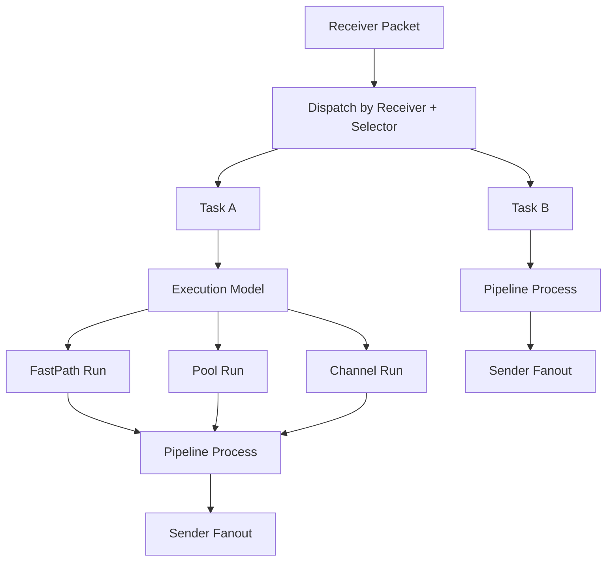

# forward-stub

`forward-stub` 是一个面向高吞吐、低延迟、可热更新场景的 Go 转发引擎。系统把协议接入、选择、处理、分发统一抽象为 `receiver -> selector -> task(pipeline + sender)`，通过配置把 UDP/TCP/Kafka/SFTP 组合成可运行的数据转发链路。`selector.source` 为空表示 default selector；同一 receiver 最多只能有一个 default selector，且仅在该 receiver 下所有 source selector 都未命中时才会生效。

## 1. 项目简介

本项目解决的核心问题：

- 将多协议输入统一收敛为内部 `packet.Packet` 数据模型。
- 通过可编排 `task` 把处理逻辑和下游分发策略配置化。
- 在不停机前提下更新业务拓扑（receiver/selector/task/pipeline/sender）。
- 提供可观测入口（日志、流量统计、pprof、benchmark）支持运维与性能分析。

## 2. 核心能力

- 支持 `udp_gnet`、`tcp_gnet`、`kafka`、`sftp` 四类 receiver。
- 支持 `udp_unicast`、`udp_multicast`、`tcp_gnet`、`kafka`、`sftp` 五类 sender。
- 内置 `match_offset_bytes`、`replace_offset_bytes`、`mark_as_file_chunk`、`clear_file_meta`、`route_offset_bytes_sender` stage。
- `task` 支持 `fastpath`、`pool`、`channel` 三种执行模型。
- runtime 支持 dispatch 快照分发，降低热路径锁竞争。
- 支持 system/business 双配置模式，兼容 legacy 单文件模式。
- 支持 business 配置热更新（文件监听 + 信号触发）。
- 支持 payload 复用、队列边界和回压控制。

## 目录结构

### 当前项目目录树

```text
.
├── main.go
├── configs/
│   ├── business.example.json
│   ├── example.json
│   └── system.example.json
├── deploy/
│   └── k8s/
├── docs/
├── scripts/
├── src/
│   ├── app/
│   ├── bootstrap/
│   ├── config/
│   ├── control/
│   ├── logx/
│   ├── packet/
│   ├── pipeline/
│   ├── receiver/
│   ├── runtime/
│   ├── sender/
│   └── task/
└── vendor/
```

### 关键目录与文件职责

- `main.go`
  - 二进制程序入口，只负责接收命令行参数并把启动流程委派给 `bootstrap.Run`。
- `configs/`
  - 存放系统配置、业务配置以及兼容 legacy 单文件模式的示例，展示当前 `receiver -> selector -> task -> pipelines -> senders` 架构的真实配置写法。
- `deploy/`
  - 放置部署侧材料，当前包含 Kubernetes ConfigMap 示例，便于将 system/business 配置映射到运行环境。
- `docs/`
  - 存放架构、配置、运行时、性能、排障等专题文档；README 用于快速导航，这里的文档负责展开细节。
- `scripts/`
  - 存放仓库辅助脚本，服务于开发、测试或运维动作，本身不参与运行时主链路。
- `src/app`
  - 应用层长生命周期包装器，向外暴露启动、停机、缓存更新与系统配置稳定性检查等能力，衔接 `bootstrap` 与 `runtime`。
- `src/bootstrap`
  - 启动编排层，负责解析参数、加载配置、应用默认值、启动 pprof、监听文件变更/信号并驱动热更新。
- `src/config`
  - 配置模型与校验中心，定义 system/business 配置结构、默认值策略、严格加载规则以及 selector/task/receiver/sender 的约束。
- `src/control`
  - 控制面接入层，用于从外部 API 拉取业务配置快照，供 `bootstrap` 合并到本地 system 配置后再下发运行时。
- `src/logx`
  - 统一日志与流量统计模块，负责全局 logger 初始化、日志等级判断、task 运行统计采集和周期性吞吐汇总输出。
- `src/packet`
  - 统一数据模型层，定义 receiver、selector、task、pipeline、sender 之间共享的 `packet.Packet`、`Meta` 和 payload 缓冲池。
- `src/pipeline`
  - 处理阶段抽象层，把多个 stage 串成 task 内部顺序执行的处理链，负责字节匹配/替换、文件语义转换、按字段路由 sender 等逻辑。
- `src/receiver`
  - 各类入站适配器，把 UDP/TCP/Kafka/SFTP 等外部输入统一转换成 `packet.Packet`，然后交给运行时 dispatch。
- `src/runtime`
  - 运行时编排核心，负责构建并热切换 `receiver -> selector -> task -> pipelines -> senders` 拓扑，维护 selector dispatch 快照、实例复用与更新缓存。
- `src/sender`
  - 各类出站适配器，负责把 task 处理后的 packet 投递到 UDP/TCP/Kafka/SFTP 等下游系统。
- `src/task`
  - 命中后的执行单元，负责根据执行模型承接 packet，串行执行 pipelines，并在末端 fan-out 到一个或多个 sender。
- `vendor/`
  - 项目当前使用的 vendored 依赖，保证构建与测试环境可复现；业务实现不在此目录中维护。

### 模块协作关系

1. `main.go` 调用 `bootstrap.Run` 启动进程。
2. `bootstrap` 读取本地文件与可选控制面配置，经 `config` 应用默认值并完成校验。
3. `app`/`runtime` 根据最新配置编译并发布运行时快照。
4. `receiver` 接收外部数据，封装为 `packet.Packet`。
5. `runtime` 依据 receiver 名称和 selector 快照进行分发，命中一个或多个 `task`。
6. `task` 按执行模型运行 `pipeline` 链，并把结果发送到 `sender`。
7. `logx` 为上述各阶段提供统一日志、统计与可观测支撑。

## 3. 系统总体架构图


## 4. 核心处理流程图



## Dispatch Model / 数据分发模型

当前分发模型已经固定为：`receiver -> selector -> task -> pipelines -> senders`。

- `receiver` 只负责把协议输入转换成统一的 `packet.Packet`。
- `selector` 负责基于 `receiver` 和 `packet.Meta.Remote` 等来源特征返回 task 集，而不是返回 bool。
- `task` 是执行单元，负责串行执行多个 pipeline，并在末端 fan-out 到 sender。
- `dispatch` 是 selector 驱动的热路径，不再维护 task 直接绑定 receiver 的旧模型。

引入 selector 的原因是把“收包入口”和“任务命中规则”解耦，使热更新时可以聚焦于 selector snapshot，而不必让 task 直接承载 receiver 绑定关系。

## Hot Path Design / 热路径设计

分发热路径围绕“最少锁、最少分配、优先快路径”设计：

- `dispatchSubs` 通过 `atomic.Value` 保存 `receiver -> selector snapshot`，让 dispatch 在读路径上避免主锁。
- 精确 source 规则会预编译成整数分发表：IPv4 走 `uint32` 地址和 `uint64(ip<<16|port)` 组合键，避免热路径拼接字符串。
- CIDR 与端口范围只保留轻量 bucket，不会在快照阶段暴力展开成海量精确 key。
- `matchDispatchTasks` 优先读取 `packet.Meta` 中结构化的源地址字段；只有缺失时才回退解析 `packet.Meta.Remote`，解析失败时安全回退到 default selector。
- 单 task 命中时直接复用原始 packet；多 task 命中时才 clone fan-out，尽量减少额外对象分配。

## 5. 快速开始

### 5.1 编译

```bash
make build
```

或直接：

```bash
go build -mod=vendor -o bin/forward-stub .
```

### 5.2 运行（双配置模式，推荐）

```bash
./bin/forward-stub \
  -system-config ./configs/system.example.json \
  -business-config ./configs/business.example.json
```

### 5.3 运行（legacy 单文件模式）

```bash
./bin/forward-stub -config ./configs/example.json
```

### 5.4 Benchmark 入口

```bash
go test ./src/runtime -bench BenchmarkScenarioForwarding -benchmem
```

## 6. Benchmark / 性能测试说明

新的 benchmark 体系只用于评估 **服务内部完整转发链路** 的理论处理上限，核心问题是：

> 在不执行真实外部 I/O 的前提下，forward-stub 在具体协议场景下能处理多快。

- 常规运行：`go test ./src/runtime -bench BenchmarkScenarioForwarding -benchmem`
- 带 profile：`go test ./src/runtime -bench BenchmarkScenarioForwarding -benchmem -cpuprofile cpu.out -memprofile mem.out`
- 单场景过滤：`go test ./src/runtime -bench 'BenchmarkScenarioForwarding/UDP_to_UDP' -benchmem`

详细设计见 `docs/benchmark.md`。

## 7. 配置快速上手（README 摘要）

### 7.1 当前支持的配置组织方式

- **双文件模式（推荐）**
  - `system-config`：`control`、`logging`、`business_defaults`
  - `business-config`：`version`、`receivers`、`senders`、`pipelines`、`selectors`、`tasks`
- **legacy 单文件模式（兼容）**
  - 使用 `-config`，同一个 JSON 同时作为 system + business 读取。

加载流程：
1. 通过 `ResolveConfigPaths` 解析 `-system-config/-business-config` 或 `-config`。
2. 使用严格 JSON 解析（禁止未知字段）。
3. `SystemConfig.Merge(BusinessConfig)` 合并。
4. 先应用 `business_defaults`，再应用代码默认值。
5. 执行全量校验后启动运行时。

> 配置字段的完整解释、默认值和约束请看 `docs/configuration.md`（权威文档）。

### 7.2 `configs/system.example.json`（完整示例）

```json
{
  "control": {
    "api": "",
    "timeout_sec": 5,
    "config_watch_interval": "2s",
    "pprof_port": 6060
  },
  "logging": {
    "level": "info",
    "file": "",
    "max_size_mb": 100,
    "max_backups": 5,
    "max_age_days": 30,
    "compress": true,
    "traffic_stats_interval": "1s",
    "traffic_stats_sample_every": 1,
    "payload_log_max_bytes": 256,
    "payload_pool_max_cached_bytes": 0
  },
  "business_defaults": {
    "task": {
      "execution_model": "pool",
      "pool_size": 4096,
      "queue_size": 8192,
      "channel_queue_size": 8192,
      "payload_log_max_bytes": 256
    },
    "receiver": {
      "multicore": true,
      "num_event_loop": 8,
      "payload_log_max_bytes": 256
    },
    "sender": {
      "concurrency": 8
    }
  }
}
```

### 7.3 `configs/business.example.json`（完整示例）

```json
{
  "version": 1001,
  "receivers": {
    "rx_udp": {
      "type": "udp_gnet",
      "listen": "0.0.0.0:19000",
      "multicore": true,
      "num_event_loop": 8,
      "read_buffer_cap": 1048576,
      "socket_recv_buffer": 1073741824,
      "log_payload_recv": false,
      "payload_log_max_bytes": 256
    },
    "rx_tcp": {
      "type": "tcp_gnet",
      "listen": "0.0.0.0:19001",
      "frame": "u16be",
      "multicore": true,
      "num_event_loop": 4,
      "socket_recv_buffer": 1073741824
    },
    "rx_kafka": {
      "type": "kafka",
      "listen": "127.0.0.1:9092",
      "topic": "input-topic",
      "group_id": "forward-stub-group",
      "client_id": "forward-stub-rx",
      "start_offset": "latest",
      "fetch_min_bytes": 1,
      "fetch_max_bytes": 1048576,
      "fetch_max_wait_ms": 100,
      "username": "kafka-user",
      "password": "kafka-pass",
      "sasl_mechanism": "PLAIN",
      "tls": false,
      "tls_skip_verify": false
    },
    "rx_sftp": {
      "type": "sftp",
      "listen": "127.0.0.1:22",
      "username": "demo",
      "password": "demo",
      "remote_dir": "/input",
      "poll_interval_sec": 3,
      "chunk_size": 65536,
      "host_key_fingerprint": "SHA256:W5M5Qf3jQ8jD8I2LqzY9zT6QfPj1O9g3k8xw0Jm9r3A"
    }
  },
  "senders": {
    "tx_udp": {
      "type": "udp_unicast",
      "local_ip": "0.0.0.0",
      "local_port": 20000,
      "remote": "127.0.0.1:21000",
      "concurrency": 8,
      "socket_send_buffer": 1073741824
    },
    "tx_mcast": {
      "type": "udp_multicast",
      "local_ip": "0.0.0.0",
      "local_port": 20001,
      "remote": "239.0.0.10:21001",
      "iface": "eth0",
      "ttl": 16,
      "loop": false,
      "concurrency": 8,
      "socket_send_buffer": 1073741824
    },
    "tx_tcp": {
      "type": "tcp_gnet",
      "remote": "127.0.0.1:21002",
      "frame": "u16be",
      "concurrency": 4,
      "socket_send_buffer": 1073741824
    },
    "tx_kafka": {
      "type": "kafka",
      "remote": "127.0.0.1:9092",
      "topic": "output-topic",
      "client_id": "forward-stub-tx",
      "acks": "all",
      "idempotent": true,
      "retries": 20,
      "max_in_flight_requests_per_connection": 1,
      "linger_ms": 5,
      "batch_max_bytes": 1048576,
      "max_buffered_bytes": 67108864,
      "max_buffered_records": 20000,
      "compression": "lz4",
      "username": "kafka-user",
      "password": "kafka-pass",
      "sasl_mechanism": "PLAIN",
      "tls": false,
      "tls_skip_verify": false
    },
    "tx_sftp": {
      "type": "sftp",
      "remote": "127.0.0.1:22",
      "username": "demo",
      "password": "demo",
      "remote_dir": "/output",
      "temp_suffix": ".tmp",
      "host_key_fingerprint": "SHA256:W5M5Qf3jQ8jD8I2LqzY9zT6QfPj1O9g3k8xw0Jm9r3A"
    }
  },
  "pipelines": {
    "pipe_match_replace": [
      {
        "type": "match_offset_bytes",
        "offset": 0,
        "hex": "aabb"
      },
      {
        "type": "replace_offset_bytes",
        "offset": 2,
        "hex": "ccdd"
      }
    ],
    "pipe_mark_file": [
      {
        "type": "mark_as_file_chunk",
        "path": "/auto/out.bin",
        "bool": true
      }
    ],
    "pipe_clear_file": [
      {
        "type": "clear_file_meta"
      }
    ],
    "pipe_route_sender": [
      {
        "type": "route_offset_bytes_sender",
        "offset": 0,
        "cases": {
          "01": "tx_udp",
          "02": "tx_tcp"
        },
        "default_sender": "tx_kafka"
      }
    ]
  },
  "selectors": {
    "sel_fastpath_default": {
      "receivers": [
        "rx_udp"
      ],
      "tasks": [
        "task_fastpath"
      ]
    },
    "sel_pool_default": {
      "receivers": [
        "rx_tcp"
      ],
      "tasks": [
        "task_pool"
      ]
    },
    "sel_channel_default": {
      "receivers": [
        "rx_kafka"
      ],
      "tasks": [
        "task_channel"
      ]
    }
  },
  "tasks": {
    "task_fastpath": {
      "pipelines": [
        "pipe_match_replace"
      ],
      "senders": [
        "tx_udp"
      ],
      "execution_model": "fastpath",
      "queue_size": 2048,
      "channel_queue_size": 2048,
      "log_payload_send": false,
      "payload_log_max_bytes": 256
    },
    "task_pool": {
      "pipelines": [
        "pipe_route_sender"
      ],
      "senders": [
        "tx_udp",
        "tx_tcp",
        "tx_kafka"
      ],
      "execution_model": "pool",
      "pool_size": 2048,
      "queue_size": 4096,
      "channel_queue_size": 4096,
      "log_payload_send": false,
      "payload_log_max_bytes": 256
    },
    "task_channel": {
      "pipelines": [
        "pipe_mark_file"
      ],
      "senders": [
        "tx_sftp"
      ],
      "execution_model": "channel",
      "channel_queue_size": 1024,
      "log_payload_send": false,
      "payload_log_max_bytes": 256
    }
  }
}
```

### 7.4 legacy `configs/example.json` 对照

legacy 模式仍支持，但推荐仅用于兼容旧部署。它等价于把上面 system/business 内容合并到一个 `Config` JSON。

## 8. 文档索引

- 配置权威文档：`docs/configuration.md`
- 运行时与生命周期：`docs/runtime-and-lifecycle.md`
- 执行模型：`docs/execution-model.md`
- 收发器说明：`docs/receivers-and-senders.md`
- Pipeline 说明：`docs/pipeline.md`
- 运维手册：`docs/operations.md`
- 观测与排障：`docs/observability.md` / `docs/troubleshooting.md`
