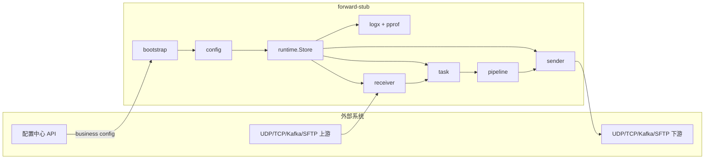

# Architecture

## 1. 系统定位

`forward-stub` 是一个面向在线转发链路的可编排引擎，目标是把多协议收发、轻量处理和多下游分发统一到同一运行时框架中。核心抽象是：

- `receiver`：把外部输入转成内部 `packet.Packet`。
- `task`：调度执行 `pipeline + sender`。
- `pipeline`：按 stage 顺序处理数据和元信息。
- `sender`：把处理结果发送到目标协议。

## 2. 架构设计目标

1. **高吞吐**：使用 gnet 事件驱动网络收发、dispatch 快照、payload 复用降低热路径成本。
2. **低延迟**：提供 fastpath 同步模型减少调度跳转。
3. **可热更新**：业务配置可增量替换，系统配置保持稳定基线。
4. **可维护**：模块边界清晰（config/runtime/task/receiver/sender/pipeline）。

## 3. 总体架构与外部系统关系

## 4. 模块划分（按源码目录）

- `src/bootstrap`：命令行参数、配置加载、文件监听、信号处理、pprof 服务生命周期。
- `src/config`：`SystemConfig/BusinessConfig/Config` 模型、`ApplyDefaults`、`Validate`、双文件合并。
- `src/runtime`：pipeline 编译、组件构建、dispatch 快照、全量/增量更新。
- `src/task`：执行模型（`fastpath/pool/channel`）、in-flight 计数、优雅停止。
- `src/receiver`：`Receiver` 接口及 UDP/TCP/Kafka/SFTP 实现。
- `src/sender`：`Sender` 接口及 UDP/TCP/Kafka/SFTP 实现。
- `src/pipeline`：stage 函数定义与处理链执行。
- `src/logx`：zap 日志包装、流量统计聚合。

## 5. 控制面与数据面

### 控制面

- 配置来源：本地 `system-config/business-config` 或 `control.api` 拉取 business 配置。
- 配置路径：`load -> defaults -> validate -> runtime.UpdateCache`。
- 变更触发：文件指纹监听、`HUP/USR1` 信号触发 reload。

### 数据面

- 入口：receiver 收包。
- 分发：dispatch 根据 `receiver -> tasks` 快照 fan-out。
- 处理：task 按执行模型跑 pipeline。
- 出口：sender 发送到下游。

## 6. 运行时更新路径与编译路径

1. `runtime.compilePipelinesWithStageCache` 将 stage 配置编译为 `pipeline.StageFunc`。
2. 先构建 sender，再构建 task（绑定 pipeline + sender），最后启动 receiver。
3. 启动 receiver 前生成 dispatch 快照，降低切换窗口漏分发风险。
4. 若已存在运行态对象，优先尝试业务增量更新；否则走全量替换。

## 7. 为何适合高吞吐/低延迟/热更新

- **高吞吐**：gnet + ants + dispatch 原子快照 + payload 复用。
- **低延迟**：fastpath 模型下在同 goroutine 内直接处理发送。
- **热更新**：业务配置增量编译与切换，系统配置变更时显式拒绝热更新，避免不一致。
