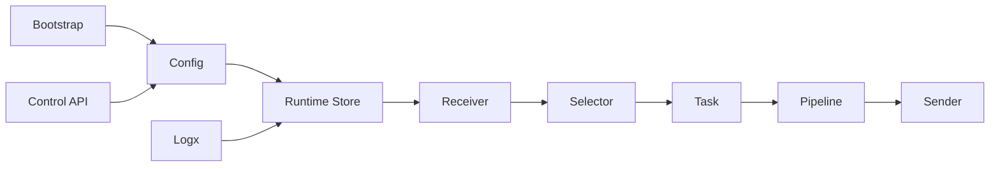

# Architecture

> 架构基线：`receiver -> selector -> task -> pipelines -> senders`。receiver 只负责收包，selector 返回 task 集，task 负责串行执行 pipelines 并在末端 fan-out 到 senders。

## 1. 系统定位

`forward-stub` 是一个配置驱动的转发引擎。核心目标不是提供复杂业务计算，而是稳定地完成多协议接入、轻量数据处理和多下游分发。

系统的基础抽象由四个对象组成：

- `receiver`：协议输入端，负责把外部数据转成 `packet.Packet`。
- `selector`：匹配单元，负责按 packet 来源特征返回 task 集。
- `task`：执行单元，负责串行执行 pipeline 并调用 sender。
- `pipeline`：处理链，负责 stage 顺序处理和路由信息写入。
- `sender`：协议输出端，负责将 packet 发送到下游。

## 2. 核心设计目标

1. **吞吐优先**：热路径减少锁竞争与对象分配。
2. **延迟可控**：支持 fastpath 同步执行和 pool/channel 异步执行。
3. **热更新可运维**：业务拓扑支持在线更新，系统配置保持边界。
4. **模块可演进**：receiver/sender/stage 均可通过接口扩展。

## 3. 架构分层

- **入口与控制层**：`src/bootstrap`、`src/app`、`src/control`
- **配置层**：`src/config`
- **运行时编排层**：`src/runtime`、`src/task`
- **协议接入层**：`src/receiver`
- **处理层**：`src/pipeline`
- **协议发送层**：`src/sender`
- **观测层**：`src/logx`

## 4. 关键抽象关系

`selector + task` 共同构成热路径核心：

- 上游通过 dispatch 先按 receiver 命中 selector 快照。
- selector 返回 task 集后再投递给 task。
- task 内部按执行模型运行 pipeline。
- pipeline 可修改 payload 和 metadata。
- task 最终调用 sender fanout 发送。

这使得 receiver 与 sender 解耦，新增协议实现时不会侵入核心调度路径。

## 5. 架构图

## 6. 数据流与控制流

### 数据流

1. receiver 收包并构造 `packet.Packet`。
2. runtime.dispatch 按 receiver 名字查 selector 快照，并基于源地址/端口找到 task 集。
3. task 执行 pipeline stage。
4. sender 将处理结果写出。

### 控制流

1. bootstrap 解析参数并加载配置。
2. config 应用默认值并校验。
3. runtime 按配置构建 sender/task/receiver。
4. 热更新触发后重走编译与替换流程。

## 7. 适配高吞吐低延迟热更新的原因

- `dispatchSubs` 使用 `atomic.Value` 保存 receiver -> selector dispatch state 只读快照，减少分发路径锁；其中精确规则会被预编译到整数分发表，范围规则保留为轻量 bucket。
- 多订阅场景 clone packet，避免任务间共享释放竞争。
- `task` 提供三种执行模型，允许按链路特征优化。
- runtime 构建顺序先 sender 后 task，再编译 selector 快照，最后启动 receiver，缩小切换窗口。
- business 配置可以增量更新，系统配置通过基线比对避免漂移。

## 8. 当前优势与局限

### 优势

- 拓扑可配置且模块边界清晰。
- 协议覆盖已包含网络流、消息总线和文件通道。
- 运维入口完整，具备日志、pprof、benchmark。

### 局限

- 待确认：缺少内建 Prometheus 指标导出端点。
- route stage 仅支持固定偏移字节匹配，不支持复杂表达式。
- 更复杂的可靠性策略主要依赖下游协议能力与外部编排。
