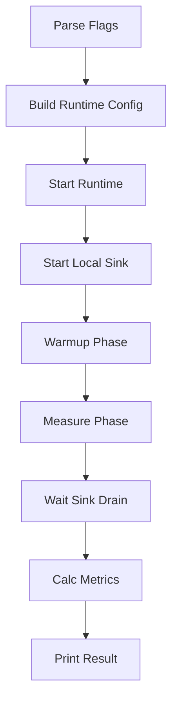

# Bench Guide

## 1. 设计目的

`cmd/bench` 是 forward-stub 的本地链路压测与回归工具，目标是用统一入口验证以下问题：

1. 当前代码在 UDP/TCP 转发路径下的基础吞吐能力。
2. `fastpath`、`pool`、`channel` 三种 task 执行模型在同等条件下的差异。
3. 参数调整（payload、workers、队列、event loop）是否带来可重复收益。
4. 代码改动后是否出现明显退化（回归基线）。

它面向“开发和运维的可重复对比”，不是生产容量评估的唯一依据。

## 2. bench 测试对象与覆盖边界

### 覆盖对象

bench 会在进程内创建一个最小可运行 runtime 拓扑：

- 一个 receiver（UDP 或 TCP）
- 一个空 pipeline
- 一个 sender（UDP unicast 或 TCP）
- 一个 task（可切换执行模型）

并通过本地 generator 持续打包，sink 统计收包结果。

### 重点覆盖路径

- runtime `UpdateCache` 构建路径
- dispatch 到 task 的分发路径
- task 执行模型路径
- sender 写出路径

### 不覆盖或弱覆盖

- Kafka/SFTP 真实外部依赖链路
- 生产网络拓扑、跨主机抖动、磁盘性能
- 复杂 pipeline stage 组合

上述场景需要结合真实环境专项压测（待确认：后续是否补独立 e2e benchmark 套件）。

## 3. 执行流程



## 4. 参数说明与默认值

> 参数定义以 `cmd/bench/main.go` 为准。

### 4.1 核心运行参数

- `-mode`：`udp|tcp|both`，默认 `both`
- `-duration`：测量窗口，默认 `8s`
- `-warmup`：预热窗口，默认 `2s`
- `-payload-size`：每包有效载荷，默认 `512`
- `-workers`：生成器并发，默认 `max(1, NumCPU/2)`
- `-pps-per-worker`：每 worker 限速，`0` 为不限速
- `-pps-sweep`：按 pps 列表批量跑场景，例如 `2000,4000,8000`

### 4.2 执行模型参数

- `-task-execution-model`：`fastpath|pool|channel`
- `-task-fast-path`：兼容开关（当 execution_model 为空时生效）
- `-task-pool-size`：pool worker 数，默认 `2048`
- `-task-queue-size`：pool 队列上限，默认 `4096`
- `-task-channel-queue-size`：channel 队列上限，`<=0` 回退 queue_size

### 4.3 接收发送相关参数

- `-multicore`：receiver gnet multicore 开关
- `-receiver-event-loops`：receiver event loop 数
- `-receiver-read-buffer-cap`：receiver 读缓冲 cap
- `-tcp-sender-concurrency`：TCP sender 并发连接数
- `-base-port`：基准端口，默认 UDP 19100 / TCP 19200

### 4.4 观测与校验参数

- `-log-level`、`-log-file`
- `-traffic-stats-interval`
- `-validate-order`：严格顺序校验（要求 payload-size >= 8）

### 4.5 配置文件方式

- `-bench-config`：读取 JSON 覆盖参数
- 示例文件：`configs/bench.example.json`

## 5. 运行示例

### 5.1 smoke test

```bash
go run ./cmd/bench -mode udp -duration 2s -warmup 500ms -payload-size 256 -workers 2
```

### 5.2 模型对比

```bash
# fastpath
go run ./cmd/bench -mode udp -duration 4s -warmup 1s -task-execution-model fastpath -workers 4

# pool
go run ./cmd/bench -mode udp -duration 4s -warmup 1s -task-execution-model pool -task-pool-size 2048 -task-queue-size 4096 -workers 4

# channel
go run ./cmd/bench -mode udp -duration 4s -warmup 1s -task-execution-model channel -task-channel-queue-size 4096 -workers 4
```

### 5.3 sweep 场景

```bash
go run ./cmd/bench -mode both -duration 4s -warmup 1s -pps-sweep 2000,4000,8000 -payload-size 512 -workers 4
```

### 5.4 顺序性校验

```bash
go run ./cmd/bench -mode tcp -validate-order -payload-size 512 -duration 3s -warmup 1s
```

## 6. 输出结果解释

bench 最终通过日志输出关键字段（`forward benchmark result`）：

- `proto`：协议模式
- `duration`：实际测量时长
- `payload_size`：每包有效载荷字节
- `workers`：生成器并发
- `sent_packets/sent_bytes`：测量窗口内发送计数
- `recv_packets/recv_bytes`：测量窗口内接收计数
- `loss_rate`：`(sent-recv)/sent`
- `order_errors`：顺序校验失败次数
- `strict_order_ok`：顺序校验是否通过
- `pps`：`recv_packets / duration`
- `mbps`：`recv_bytes * 8 / duration / 1e6`

## 7. 推荐测试方法

### 7.1 单次冒烟

- 固定小流量短时窗口，先验证是否可运行。

### 7.2 模型对比

- 同一 payload、workers、duration，分别跑 fastpath/pool/channel。
- 对比 `pps/loss_rate/order_errors`。

### 7.3 配置回归

- 固定一组标准参数作为基线。
- 每次代码改动后复跑同一命令。
- 仅当结果持续偏离才判定退化，避免单次抖动误判。

### 7.4 优化前后对比

- 保持单变量原则。
- 每次只改一个参数或一个实现点。

## 8. 结果解读注意事项

1. bench 更适合横向对比，不宜直接当生产容量承诺。
2. `both` 模式是顺序执行 udp 再 tcp，不是并行混压。
3. `pps-per-worker=0` 表示不限速，结果更依赖本机资源与调度。
4. `validate-order` 开启后，会增加额外校验开销。
5. 短测量窗口更容易受调度抖动影响，建议对关键结论延长 duration。

## 9. 与项目模块关系

- 与 runtime：通过 `app.Runtime.UpdateCache` 动态创建测试拓扑。
- 与 task：直接验证执行模型与队列参数。
- 与 dispatch：覆盖 receiver 到 task 的分发路径。
- 与 pipeline：默认空 pipeline，主要测调度和发送路径。
- 与 sender：覆盖 UDP/TCP sender 发包逻辑和并发设置影响。

## 10. 常见问题

### 10.1 bench 启动失败

- 检查端口是否被占用（`-base-port`）
- 检查 `payload-size` 与 `validate-order` 组合是否合法

### 10.2 结果波动大

- 拉长 `duration`
- 固定 `workers`、`payload-size`、`pps-per-worker`
- 避免并行运行其他重负载程序

### 10.3 如何做可信对比

- 固定机器和环境
- 固定参数和运行顺序
- 每组至少运行多轮取中位数或均值

## 11. 交叉阅读

- `docs/performance.md`：性能设计点与优化路径
- `docs/operations.md`：运维使用入口
- `docs/observability.md`：日志与观测方法
