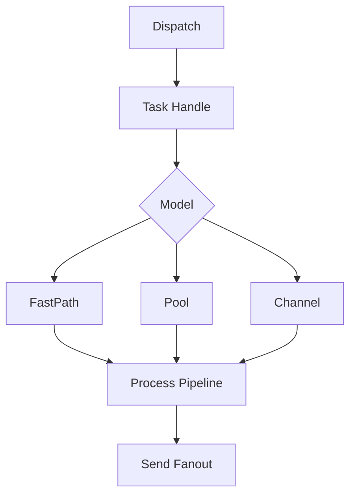

# Execution Model

## 1. 设计目的

`Task` 负责把 packet 变成下游发送动作。为兼顾不同链路目标，系统提供三种执行模型：

- `fastpath`
- `pool`
- `channel`

模型由 `task.execution_model` 决定，默认值可来自 `business_defaults.task.execution_model`。

## 2. 三种模型执行路径

## 3. fastpath

### 机制

- 当前 goroutine 直接执行 `processAndSend`。
- 不经过额外队列和 worker。

### 影响

- 固定开销低，延迟路径最短。
- 下游慢会直接反压上游 receiver。

### 场景

- 处理逻辑很轻。
- 对延迟敏感，且下游稳定。

## 4. pool

### 机制

- 使用 ants 池提交任务。
- `pool_size` 控制 worker，`queue_size` 控制最大阻塞任务。

### 影响

- 吞吐更稳健，易横向放大并发。
- 队列积压时尾延迟可能上升。
- 队列满会丢包并记录告警日志。

### 场景

- 通用生产场景。
- 需要平衡吞吐与隔离。

## 5. channel

### 机制

- 单 worker goroutine 读取有界 channel。
- `channel_queue_size` 控制排队深度。

### 影响

- 单 task 内顺序语义清晰。
- 峰值吞吐受单 worker 限制。

### 场景

- 顺序敏感链路。
- 处理逻辑中等，流量可控。

## 6. 模型对比

| 维度 | fastpath | pool | channel |
|---|---|---|---|
| 吞吐上限 | 中到高 | 高 | 中 |
| 延迟 | 最低 | 中 | 中到高 |
| 顺序性 | 取决于并发 | 弱 | 强 |
| 隔离性 | 低 | 高 | 中 |
| 回压位置 | 直接到上游 | 队列边界 | channel 边界 |

## 7. 与 task/pipeline/sender 的关系

- 模型只改变“如何执行”，不改变 pipeline/sender 业务语义。
- 三种模型最终都走同一条 `pipeline -> sender` 逻辑。
- route stage、生效 sender 列表、日志策略在三种模型下保持一致。

## 8. 选型建议

1. 首选 `pool` 作为默认模型。
2. 极低延迟链路评估 `fastpath`。
3. 顺序敏感链路选 `channel`。
4. 所有模型都应配合 bench 做场景验证。
