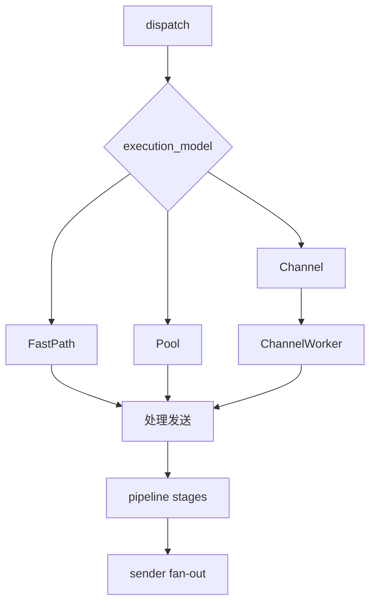

# Execution Model

`src/task/task.go` 提供三种执行模型：`fastpath`、`pool`、`channel`。三者共享相同的业务语义（pipeline -> sender），差异在调度方式和回压行为。

## 1. 三种模型对比

| 模型 | 实现方式 | 优势 | 风险 | 适用场景 |
|---|---|---|---|---|
| `fastpath` | `dispatch` 线程同步执行 `processAndSend` | 路径最短、延迟最低、无额外排队 | 下游慢会直接阻塞上游入口 | 处理轻、下游稳定、低时延优先 |
| `pool` | ants worker pool + 有界阻塞队列 | 并发能力强，吞吐上限高 | 队列积压时尾延迟增大 | 通用高吞吐场景 |
| `channel` | 单 goroutine + 有界 channel | 顺序语义最明确、行为简单 | 单消费者上限明显 | 强顺序或串行处理场景 |

## 2. 调度路径差异

## 3. 任务调度与隔离方式

- 任务级隔离：每个 task 持有自己的执行配置（pool 大小、队列大小、channel 队列）。
- 包生命周期隔离：dispatch 对多订阅任务会 `Clone()` packet，避免共享释放冲突。
- 停机隔离：`accepting + inflight.WaitGroup` 保证拒绝新包后等待在途处理完成。

## 4. 对吞吐、延迟、顺序性、回压的影响

### 吞吐

- `pool` 通常最稳健，适合 CPU/IO 混合负载。
- `fastpath` 在轻处理和稳定下游时可获得更低固定开销。
- `channel` 上限受单消费者影响。

### 延迟

- `fastpath` 最低。
- `pool` 取决于 worker 和队列压力。
- `channel` 在低负载下可控，但高负载会形成排队延迟。

### 顺序性

- `channel` 最容易保证单 task 内输入顺序。
- `pool`/`fastpath` 在多并发源或多订阅场景下不保证全局顺序。

### 回压

- `pool`：`ants.WithMaxBlockingTasks(queue_size)` 提供有界回压，满队列会丢包并记录日志。
- `channel`：有界 channel 满时会阻塞到 ctx 取消，随后丢包并告警。
- `fastpath`：回压直接传递到调用栈（常体现为 receiver 处理变慢）。

## 5. 选型建议

1. 默认优先 `pool`，结合 `pool_size/queue_size` 调优。
2. 对极低延迟链路，且 sender 稳定时选择 `fastpath`。
3. 需要强顺序时使用 `channel`，并控制单 task 负载。
4. 生产环境建议结合 `cmd/bench` 对三种模型做场景压测后确定。
