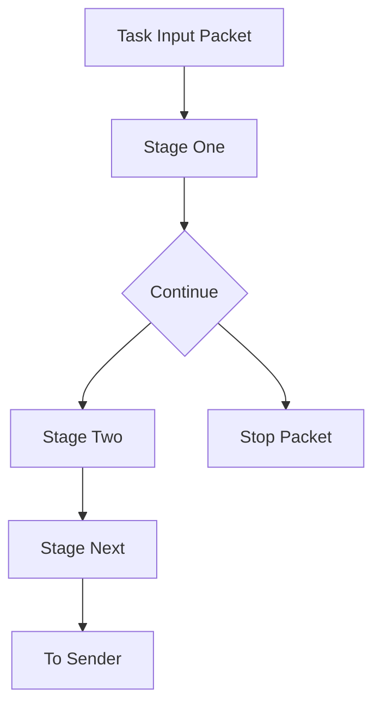

# Pipeline

## 1. pipeline 职责

pipeline 是 task 内部的数据处理链。它负责在发送前对 packet 做轻量处理与元信息修改。

边界：

- pipeline 不负责并发调度。
- pipeline 不负责网络 IO。
- pipeline 仅处理 packet 内容与 metadata。

## 2. stage 抽象

`StageFunc` 签名：`func(*packet.Packet) bool`。

语义：

- 返回 `true`：继续后续 stage。
- 返回 `false`：终止当前 packet 的后续流程。

## 3. pipeline 主流程图

## 4. 当前 stage 类型与用途

### match_offset_bytes

- 作用：按偏移匹配字节序列。
- 典型用途：协议头过滤。
- 不通过则直接停止该 packet。

### replace_offset_bytes

- 作用：按偏移覆盖字节。
- 典型用途：报文字段轻量改写。

### mark_as_file_chunk

- 作用：把 packet 标记为文件分块语义并补齐元信息。
- 典型用途：流转文件输出到 sftp。

### clear_file_meta

- 作用：清理文件相关 metadata，恢复 stream 语义。
- 典型用途：文件分块转回普通流。

### route_offset_bytes_sender

- 作用：根据偏移字段匹配结果设置 `Meta.RouteSender`。
- 典型用途：在同一 task 内按业务键路由不同 sender。

## 5. stage 组合策略

建议顺序：

1. 过滤类 stage（match）。
2. 改写类 stage（replace）。
3. 语义类 stage（file meta）。
4. 路由类 stage（route）。

这样可以尽早过滤无效数据，降低后续处理和发送开销。

## 6. stage 如何影响 sender

- route stage 可改变 task 最终目标 sender。
- mark_as_file_chunk 会改变 `Kind` 与 metadata，影响 sftp sender 行为。
- clear_file_meta 可撤销文件语义，恢复普通 sender 处理路径。

## 7. 特殊行为与约束

- route stage 要求 case key 的 hex 长度一致。
- route 目标 sender 必须属于 task sender 列表。
- stage 配置错误会在编译阶段报错并阻止新配置生效。
