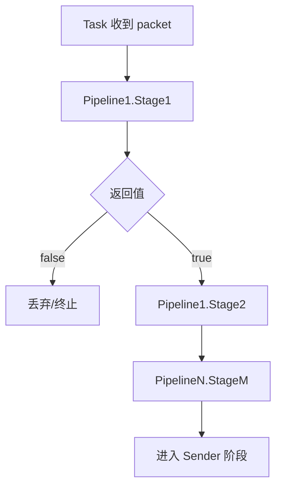

# Pipeline

## 1. 职责

`pipeline.Pipeline` 是 task 内的顺序处理链：

- 输入：`*packet.Packet`
- 输出：`bool`（`false` 表示终止该包后续处理）

task 会按 `pipelines` 列表顺序执行多个 pipeline，每个 pipeline 内按 stage 顺序执行。

## 2. stage 抽象模型

- 类型：`type StageFunc func(*packet.Packet) bool`
- 编译：`runtime.compileStage` 将 `config.StageConfig` 转成 `StageFunc`。
- 缓存：`compilePipelinesWithStageCache` 通过 stage signature 复用已编译 stage。

## 3. 当前 stage 类型

- `match_offset_bytes`
- `replace_offset_bytes`
- `mark_as_file_chunk`
- `clear_file_meta`
- `route_offset_bytes_sender`

## 4. 核心处理流

## 5. 输入输出语义

- stage 对 packet **原地修改**（如 offset replace、meta 标记）。
- 任一 stage 返回 `false`，当前 packet 在 task 中止，不再发送到 sender。
- 多 task 订阅同一 receiver 时，dispatch 会 clone packet，避免 task 间相互污染。

## 6. 关键 stage 说明

### match / replace

- `match_offset_bytes`：按固定偏移比较字节序列，不匹配则返回 false。
- `replace_offset_bytes`：按偏移覆盖字节内容，常用于轻量字段改写。

### 文件语义

- `mark_as_file_chunk`：将流数据标记为文件分块（设置 `Kind` 和 `Meta`）。
- `clear_file_meta`：清理文件元信息，把语义恢复为普通流。

### sender 路由

- `route_offset_bytes_sender`：根据 payload 指定偏移字段映射 sender。
- 若命中 route，则 task 优先单路发送到指定 sender。

## 7. 与 sender 的衔接

- pipeline 完成后，task 进入 sender fan-out。
- 若设置了 `Meta.RouteSender`，优先发送到命中的 sender；未命中 fallback 到 fan-out 列表。

## 8. 配置建议

1. 把“过滤型 stage”放在前面，尽早止损。
2. 仅在需要时使用 payload 改写 stage，减少额外开销。
3. route stage 的 cases 需覆盖主要键值，避免无意丢弃。
