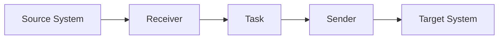

# Receivers and Senders

> 架构基线：`receiver -> selector -> task -> pipelines -> senders`。receiver 只负责收包，selector 返回 task 集，task 负责串行执行 pipelines 并在末端 fan-out 到 senders。

## 1. 抽象职责

### Receiver 抽象

接口：`Name/Key/Start/Stop`。

职责：

- 协议读取。
- 必要解帧。
- 填充 `packet.Packet`。
- 调用回调进入 dispatch。

### Sender 抽象

接口：`Name/Key/Send/Close`。

职责：

- 协议编码与连接管理。
- 按 sender 类型发送 payload。
- 在关闭阶段释放资源。

## 2. Receiver 类型差异

- `udp_gnet`：事件驱动 UDP 收包，适合高 PPS。
- `tcp_gnet`：TCP 收包并可做 framing。
- `kafka`：消费 topic，适合总线型接入。
- `sftp`：轮询目录读取文件块。

## 3. Sender 类型差异

- `udp_unicast`：点对点 UDP 发送。
- `udp_multicast`：组播分发。
- `tcp_gnet`：TCP 发送，可配置并发连接。
- `kafka`：生产到 topic，支持 batch/compression。
- `sftp`：写文件到远端目录。

## 4. 协议流程图

## 5. 与 task 和 pipeline 的协作

- receiver 不做业务编排，只负责输入。
- task 负责模型选择和 sender fanout。
- pipeline 负责字段匹配替换、文件语义标记、路由 sender。
- sender 只关注输出协议，不处理上游路由策略。

## 6. 常见组合

1. UDP receiver + Kafka sender：网络流入总线。
2. Kafka receiver + TCP sender：消息流出服务。
3. SFTP receiver + Kafka sender：文件导入消息系统。
4. UDP receiver + SFTP sender：流转文件落盘。

## 7. 可靠性性能复杂度对比

| 类型 | 可靠性特征 | 性能特征 | 配置复杂度 |
|---|---|---|---|
| UDP | 依赖上层重试 | 低开销高吞吐 | 低 |
| TCP | 连接可靠传输 | 吞吐稳定 | 中 |
| Kafka | broker 持久化能力 | 批量高吞吐 | 中到高 |
| SFTP | 文件语义与 SSH 安全 | 吞吐受远端 IO 影响 | 高 |

## 8. 配置注意事项

- Kafka/SFTP 建议使用安全配置并通过密钥系统注入凭据。
- SFTP 指纹必须准确，否则连接会被拒绝。
- UDP/TCP 建议结合 socket buffer 与并发设置联调。

## 9. 待确认

- SFTP receiver 对重复消费文件的幂等策略，需要补充专题设计说明。
