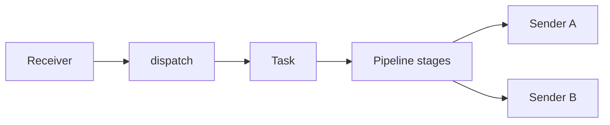

# Receivers and Senders

## 1. 抽象职责

### Receiver

接口：`src/receiver/receiver.go`

- `Start(ctx, onPacket)`：启动接收循环并把数据回调为 `packet.Packet`。
- `Stop(ctx)`：停止接收。

职责：协议解包、必要元信息填充、进入 dispatch。

### Sender

接口：`src/sender/sender.go`

- `Send(ctx, *packet.Packet)`：发送 packet。
- `Close(ctx)`：释放连接和资源。

职责：协议编码与目标投递。

## 2. 当前支持的 receiver 类型

- `udp_gnet`
- `tcp_gnet`
- `kafka`
- `sftp`

## 3. 当前支持的 sender 类型

- `udp_unicast`
- `udp_multicast`
- `tcp_gnet`
- `kafka`
- `sftp`

## 4. 协议使用要点（摘要）

| 类型 | 配置要点 | 备注 |
|---|---|---|
| `udp_gnet` | `listen`、`multicore`、`num_event_loop`、`socket_recv_buffer` | 适合高并发短报文。 |
| `tcp_gnet` | `listen/remote`、`frame`、缓冲配置 | 需要关注 framing 对齐。 |
| `kafka` | broker、topic、auth、tls、fetch/producer 参数 | 适合总线解耦。 |
| `sftp` | 账号、目录、chunk、`host_key_fingerprint` | 强制主机指纹校验。 |

## 5. 与 task/pipeline 的关系

- receiver 只负责输入，不做复杂业务编排。
- sender 只负责输出，不参与上游调度。
- 任务编排（receiver 订阅、pipeline 链、sender fan-out）由 `tasks` 配置定义。

## 6. 典型协议转换组合

- UDP -> TCP（实时流网关）
- UDP -> Kafka（实时流入总线）
- Kafka -> SFTP（流转文件落地）
- SFTP -> Kafka（文件导入消息流）

## 7. route stage 与 sender 选择

当 pipeline 使用 `route_offset_bytes_sender` 时：

- route stage 会写入 `pkt.Meta.RouteSender`。
- task 优先按 route 指定 sender 发送。
- route 目标必须是 task 已绑定 sender（配置校验已覆盖）。

## 8. 待确认项

- SFTP receiver 对远端文件“已消费标记/重试幂等策略”在仓库内未见统一设计文档（待确认）。
