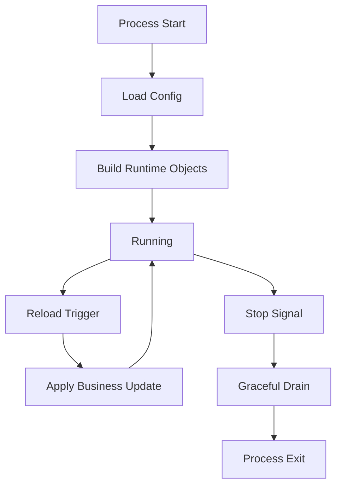

# Runtime and Lifecycle

## 1. 文档目标

本文说明系统如何从配置文件变成运行中的 receiver/selector/task/pipeline/sender 实例，以及热更新和退出时的资源管理路径。

## 2. 启动流程

入口：`main.go` 调用 `bootstrap.Run`。

1. 解析参数：`-system-config`、`-business-config`、`-config`、`-version`。
2. 通过 `config.ResolveConfigPaths` 确认配置模式。
3. `loadConfigPair` 加载 system/business 并合并。
4. `ApplyDefaults` 和 `Validate` 形成可运行配置。
5. 初始化 `logx`。
6. 按 `control.pprof_port` 启动 pprof 服务。
7. 创建 `app.Runtime` 并执行首次 `UpdateCache`。
8. 记录 system 配置基线，启动文件监听和信号监听。

## 3. 运行时构建逻辑

runtime 的核心在 `runtime.UpdateCache`。

关键入口函数：

- `app.Runtime.UpdateCache`
- `runtime.UpdateCache`
- `Store.replaceAll`
- `Store.applyBusinessDelta`

### 3.1 构建顺序

1. 编译 pipeline（含 stage cache）。
2. 构建 sender。
3. 构建 task（仅绑定 pipeline + sender）。
4. 生成 selector dispatch 快照。
5. 构建并启动 receiver。

该顺序降低了“receiver 已接收但 task 未就绪”的风险。

### 3.2 Store 关键结构

- `receivers/senders/tasks/pipelines`：运行中实例索引。
- `selectorCfg`：selector 配置快照。
- `dispatchSubs`：receiver -> selector dispatch state 快照（`atomic.Value`）。
- `recvPayloadLogOptions`：receiver 观测策略快照。
- `stageCache`：已编译 stage 的可复用缓存。

## 4. 热更新机制

触发来源：

- 文件内容变化（指纹轮询）。
- 信号触发（Unix 下 HUP/USR1）。

流程：

1. 重新加载配置。
2. 校验 system 配置是否与基线一致。
3. 仅当 system 稳定时更新 business 配置。
4. runtime 尝试增量更新；无法增量时回退全量替换。

说明：

- system 配置基线由 `SeedSystemConfig` 记录。
- reload 时由 `CheckSystemConfigStable` 拒绝 system 漂移。
- business 更新仍会再次经过 `ApplyDefaults + Validate`。

## 5. 资源创建复用销毁路径

### 创建

- sender：由 `buildSender` 创建，按名字注册。
- task：绑定 pipeline 和 sender 后 `Task.Start`。selector 不创建 goroutine，而是编译成 dispatch 快照。
- receiver：由 `buildReceiver` 创建并异步启动。

### 复用

- sender 可被多个 task 引用，`SenderState.Refs` 追踪引用数。
- stage 通过 signature 在 `stageCache` 复用。
- task 重建时可复用流量统计对象。

复用判定的价值：

- 降低热更新期间对象重建与连接抖动。
- 缩短配置切换窗口。

### 销毁

- `Store.StopAll` 并发停止 receiver 和 sender。
- task 调用 `StopGraceful`，等待 in-flight 完成。
- close 阶段使用 `multierr` 聚合错误。

## 6. 关闭流程

接收到停止信号后：

1. 停止配置监听和信号监听。
2. 调用 runtime `Stop`。
3. 关闭 pprof 服务。
4. 刷新并关闭日志。

## 7. 生命周期图

## 8. 异常与待确认

- 配置校验失败、sender 构建失败会阻止新配置生效。
- 旧实例在替换路径中会先完成停止，避免资源泄漏。
- 待确认：control API 拉取失败时是否需要更细粒度重试策略文档化。

## 9. 生命周期维护建议

1. 生产变更优先更新 business 配置，避免触发 system 漂移拒绝。
2. 变更后检查启动日志中 `runtime cache updated` 与 task 快照输出。
3. 若频繁全量替换，应评估是否可通过配置结构降低重建范围。
