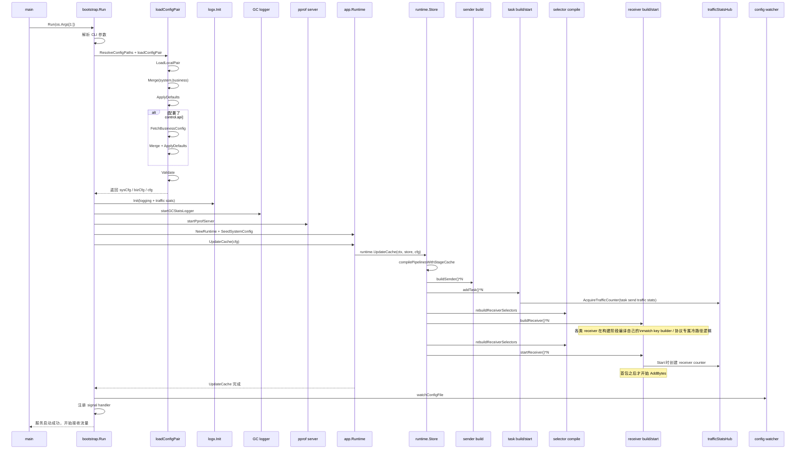
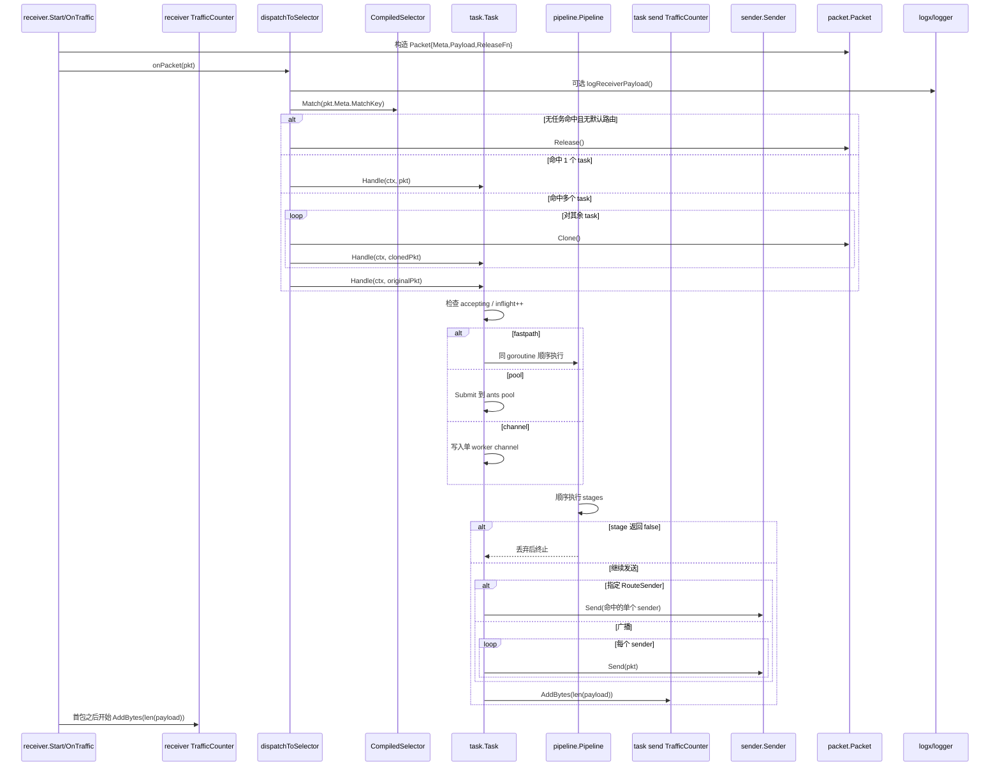
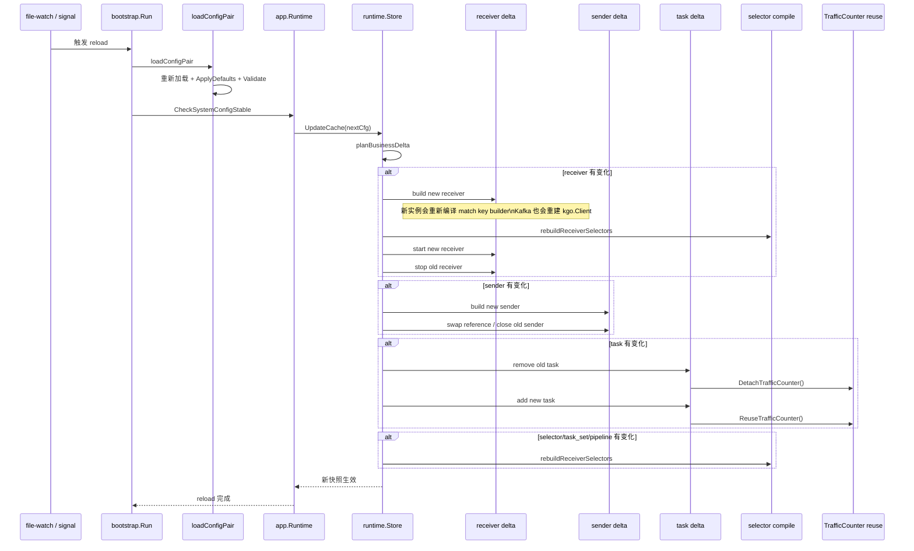

# 运行时时序与核心流转说明

> 本文档以当前代码实现为准，串联 `main -> bootstrap.Run -> app.Runtime -> runtime.Store` 的实际行为，重点说明服务启动、数据包转发、热重载、停止，以及聚合统计日志在其中的位置。

## 0. 关键对象速览

| 对象 | 代码位置 | 主要职责 |
| --- | --- | --- |
| `main` | `main.go` | 进程入口，只负责把 CLI 参数交给 `bootstrap.Run`。 |
| `bootstrap.Run` | `src/bootstrap/run.go` | 启动、重载、停机的总控流程。 |
| `app.Runtime` | `src/app/runtime.go` | 维护 system 配置基线，并把完整配置应用到 `runtime.Store`。 |
| `runtime.Store` | `src/runtime/store.go` | 保存 receivers / selectors / taskSets / senders / tasks / pipelines 的运行态快照。 |
| `runtime.UpdateCache` | `src/runtime/update_cache.go` | 冷启动或热更新时构建、替换、复用运行时对象。 |
| `receiver.*` | `src/receiver/*.go` | 从 UDP/TCP/Kafka/SFTP 等入口接收数据、生成 `match key`、构造 `packet.Packet`。 |
| `CompiledSelector` | `src/runtime/types.go` | 把 `match key -> []*TaskState` 编译成热路径可直接查表的只读快照。 |
| `task.Task` | `src/task/task.go` | 执行 pipeline、选择 sender、统计发送流量、控制执行模型。 |
| `sender.Sender` | `src/sender/*.go` | 把最终包发送到下游目标。 |
| `logx.TrafficCounter` / `trafficStatsHub` | `src/logx/traffic_agg.go` | 在热路径做轻量原子计数，在后台周期输出聚合统计摘要。 |

## 1. 服务启动流程

### 1.1 启动时序图



### 1.2 分阶段说明

#### 阶段 A：入口与参数解析

1. `main.main` 仅调用 `bootstrap.Run(os.Args[1:])`。
2. `bootstrap.Run` 创建 `stageLogger`，记录进程、Go 版本、CPU 等启动基线。
3. 启动参数支持：
   - `-config`：兼容单文件模式；
   - `-system-config` / `-business-config`：推荐双配置模式；
4. `config.ResolveConfigPaths` 会把兼容参数统一成 system/business 两条路径。

#### 阶段 B：配置加载、默认值填充与校验

`loadConfigPair` 是启动与热重载共用的配置主链路：

1. `config.LoadLocalPair` 严格读取本地 system/business 配置；
2. `sys.Merge(biz)` 合并两类配置；
3. `ApplyDefaults()` 回填默认值；
4. 若 `cfg.Control.API` 非空，则通过控制面拉取远端 business 配置；
5. 再次执行 `Merge + ApplyDefaults()`；
6. `Validate()` 做最终校验。

关键边界：

- 默认值优先在配置层完成，不留给运行时热路径猜测；
- runtime 只应用合法配置，不负责纠错；
- system 配置基线会在冷启动时写入 `app.Runtime`，后续热更新必须保持不变。

#### 阶段 C：日志、聚合统计、后台服务初始化

1. 先解析 `logging.traffic_stats_interval`。
2. `logx.Init(...)` 同时完成：
   - zap logger 初始化；
   - 滚动日志配置；
   - `SetTrafficStatsInterval`；
   - `SetTrafficStatsSampleEvery`；
3. `startGCStatsLogger` 视 `logging.gc_stats_log_enabled` 决定是否启动 GC 周期日志；
4. `startPprofServer` 视 `control.pprof_port` 决定是否启动 pprof HTTP 服务。

与聚合统计日志的关系：

- 此阶段只设置全局统计参数；
- 真正的 `trafficStatsHub.loop()` 不会立刻启动，而是在第一次 `AcquireTrafficCounter()` 时惰性启动；
- 因此“日志系统已初始化”不等于“统计线程已经有活跃 counter”。

#### 阶段 D：Runtime 基线与对象构建

1. `app.NewRuntime()` 创建应用层运行时；
2. `SeedSystemConfig(sysCfg)` 固化 system 配置基线；
3. `UpdateCache(runCtx, cfg)` 进入 runtime 更新主链路；
4. 冷启动走 `replaceAll()`：
   - 编译 pipeline 与 stage cache；
   - 构造 senders；
   - 构造并 `Start` tasks；
   - 编译 selectors；
   - 构造 receivers；
   - 再次刷新 receiver 持有的 selector 快照；
   - 启动 receivers，并把回调统一挂到 `dispatchToSelector`；
5. `waitReceiversStartInvoked` 只等待 `Start` goroutine 已被触发，不保证底层 socket、consumer group、SFTP 轮询已经完全 ready。

这里需要特别注意两点：

- receiver 构建阶段已经包含协议专属冷路径逻辑，不只是“new 一个对象”；Kafka 会在这里构造 `kgo.Client`，UDP/TCP/Kafka/SFTP 也都会在这里编译自己的 match key builder。
- receiver 聚合统计对象是在各自 `Start()` 阶段创建，不是“首包到来时才创建”；首包之后才开始 `AddBytes()`。

#### 阶段 E：进入稳定运行态

1. 读取业务配置文件指纹；
2. 启动 `watchConfigFile`；
3. 注册 `signal.Notify`；
4. 输出 `service_start`，此时服务正式对外宣告“开始接收流量”。

## 2. 数据包从 receiver 开始的转发流程

#### 2.1 转发时序图



#### 2.2 receiver 在热路径上真正做了什么

当前 receiver 的职责是：

1. 接收原始输入；
2. 生成 `packet.Packet`；
3. 生成并写入 `packet.Meta.MatchKey`；
4. 调用 runtime 注入的 `onPacket`。

也就是说，`match_key` 生成职责已经下沉到 receiver 自身：

- UDP：在 `OnTraffic` 中调用预编译 builder。
- TCP：在 `OnOpen` 建立连接时就缓存连接级 key，后续每帧复用。
- Kafka：对每条 record 调用预编译 builder。
- SFTP：对单文件生成一次 key，后续 chunk 复用。

dispatch 只消费 `pkt.Meta.MatchKey`，不再负责拼接或理解协议细节。

#### 2.3 selector / dispatch 的热路径边界

`dispatchToSelector` 只做三件事：

1. 可选打印 receiver payload 摘要日志；
2. 从 `ReceiverState.Selector` 取出只读 `CompiledSelector`；
3. 用 `pkt.Meta.MatchKey` 做一次精确查询并 fan-out 到任务切片。

因此当前运行时热路径已经稳定为：

```text
receiver(生成 MatchKey) -> dispatch(查表) -> task(执行 pipeline + sender)
```

### 2.4 聚合统计对象在收包链路中的真实行为

- receiver counter：在 `receiver.Start()` 时创建。
- receiver `AddBytes`：在真正收到报文、record、chunk 后才开始累计。
- task send counter：在 `Task.Start()` 时创建。
- task send `AddBytes`：在真正调用 sender 发送时累计。

换句话说：

- 不是“首包时才创建统计对象”；
- 而是“Start 时创建，首包之后才有累计值”。

## 3. Kafka receiver / sender 在运行时中的特殊点

### 3.1 Kafka receiver 构建期已经包含哪些冷路径逻辑

`NewKafkaReceiver()` 在启动或热重载时会提前完成：

- brokers 解析
- `group_id` 决定
- duration 解析：`dial_timeout`、`conn_idle_timeout`、`metadata_max_age`、`retry_backoff`、`session_timeout`、`heartbeat_interval`、`rebalance_timeout`、`auto_commit_interval`
- rebalance 策略解析：`balancers`
- 隔离级别解析：`isolation_level`
- `start_offset` 映射
- `fetch_*` 参数映射
- TLS / SASL 映射
- `kgo.Client` 构造
- Kafka match key builder 编译

因此 Kafka receiver 的“初始化”已经不只是普通 build，而是把一组 franz-go / `kgo` 选项预先固化进 client。

### 3.2 Kafka receiver 运行期行为

- `Start()` 时创建 receiver 统计对象。
- `PollFetches()` 拉取 record。
- 每条 record 复制 payload，构造 `packet.Packet`。
- 按 record 的 `Value` 长度累加 receiver 字节统计。
- 只有真正处理过数据后才调用 `AllowRebalance()`，减少长轮询时的无意义抖动。

### 3.3 Kafka sender 运行期行为

- sender 在构建阶段把 `acks`、`partitioner`、`compression`、`record_key_source`、buffer 限制等选项编译进并发 client 集合。
- 发送时只选择一个 shard client，构造 `kgo.Record`，同步发送。
- `record_key_source` 是 sender 运行期真正消费 `packet.Meta` 的入口之一，但它只影响 Kafka record key，不影响 selector 主路由。

## 4. 热重载流程

#### 4.1 热重载时序图



#### 4.2 热重载的入口

有两个入口：

1. **文件监听触发**：`watchConfigFile` 检测 business 文件指纹变化；
2. **信号触发**：`bootstrap.Run` 收到重载信号后直接调用 `reloadAndApplyBusinessConfig`。

统一执行函数是 `reloadAndApplyBusinessConfig`：

1. 重新加载 system + business；
2. 校验 system 配置是否仍与冷启动基线一致；
3. 调用 `runtime.UpdateCache()` 应用新 business 配置；
4. 记录重载成功或失败日志。

#### 4.3 热重载时各对象的更新语义

#### receiver

- 配置变化或新增：`buildReceiver` 新实例 -> `rebuildReceiverSelectors` -> `startReceiver` -> 停旧实例；
- 删除：从 Store 删除并异步 `Stop`；
- `match_key`、Kafka client 选项、gnet 监听参数都包含在“receiver 配置变化”里，因此都会触发 receiver 重建。

#### sender

- 配置变化或新增：先建新 sender，再替换 Store 中引用，最后关闭旧 sender；
- 删除：仅在引用计数为 0 时回收。

#### task

- 配置变化按 `remove + add` 处理；
- 同名 task 重建时：
  1. `DetachTrafficCounter()` 拿出旧发送统计句柄；
  2. 构造新 task；
  3. `ReuseTrafficCounter()` 把句柄交回新 task；
  4. 再 `Start()` 新 task，避免统计断档。

#### selector / task_set

- 变化后统一重编译每个 receiver 持有的 `CompiledSelector`；
- 热路径读取的是 `atomic.Value` 中的只读快照，切换时不会重新回退到全局锁查表。

## 5. 停机流程

### 5.1 停机顺序

1. 收到停止信号；
2. 停止配置监听；
3. 取消主运行 context；
4. 停止 GC 周期日志任务；
5. 调用 `runtime.Store.StopAll()`：
   - 并发停止 receiver；
   - 顺序 `StopGraceful()` 停 task；
   - 并发关闭 sender；
6. 停止 pprof 服务。

### 5.2 停机时统计对象如何结束

- receiver 的 `TrafficCounter` 在各自 `Start/Stop` 生命周期中关闭；
- task 的发送统计在 `Task.StopGraceful()` 中关闭；
- `trafficStatsHub` 作为进程级后台聚合器常驻，不需要在普通停机路径里逐个手动关闭。

## 6. 本文档对应的关键结论

1. `match_key` 现在是 receiver 自己的职责，构建阶段就会编译 builder，dispatch 不再拼 key。
2. receiver 聚合统计对象是在 `Start` 阶段创建，首包之后才开始 `AddBytes`。
3. Kafka receiver / sender 的大量配置已经直接映射到 franz-go / `kgo`，并在启动或热重载重建时一次性编译进 client。
4. 热更新时，receiver / sender / task 的变化都会按“构建新实例 -> 切换 -> 回收旧实例”的方式生效；system 配置变化则会被拒绝。
5. 当前热路径已经稳定为：`receiver(构造包与 MatchKey) -> selector(精确查表) -> task(执行 pipeline + sender)`。
