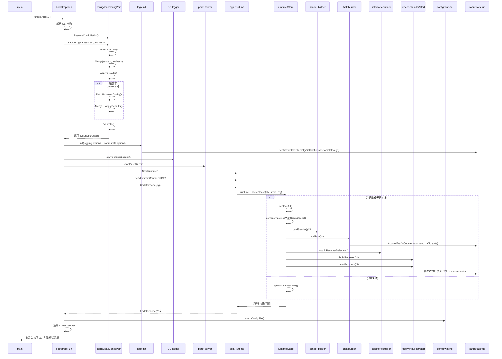
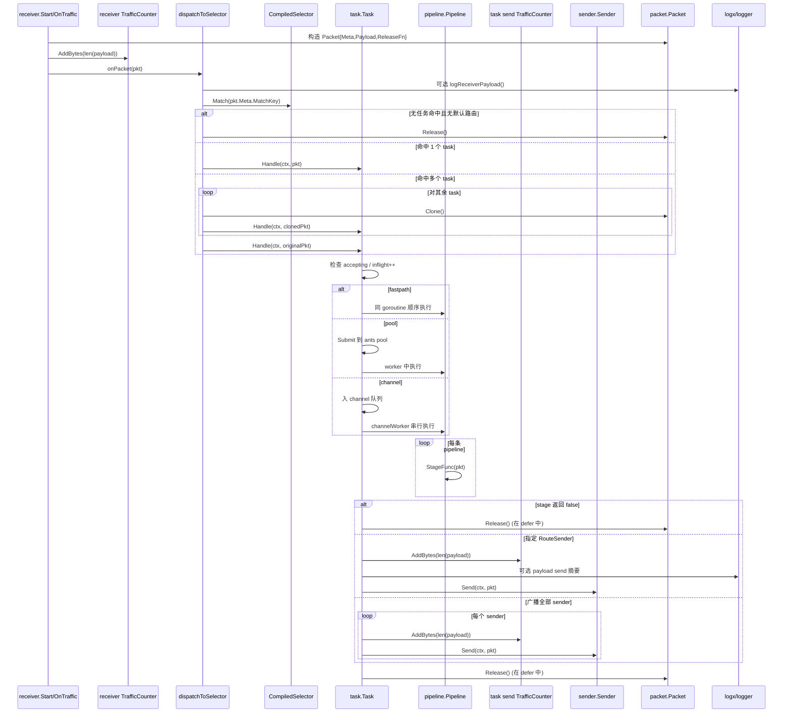
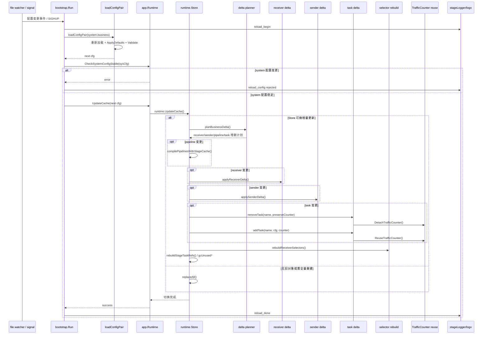
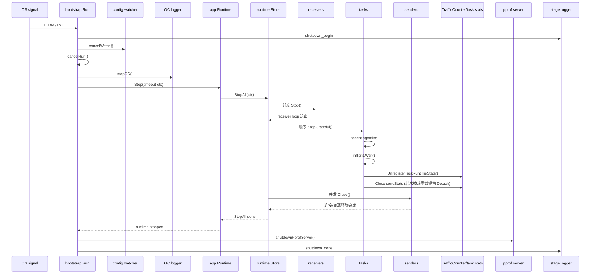

# 运行时时序与核心流转说明

> 本文档以当前代码实现为准，串联 `main -> bootstrap.Run -> app.Runtime -> runtime.Store` 的实际行为，重点说明四类核心流程：服务启动、数据包转发、热重载、停止，以及“聚合统计日志”在其中的位置。

## 0. 关键对象速览

| 对象 | 代码位置 | 主要职责 |
| --- | --- | --- |
| `main` | `main.go` | 进程入口，只负责把 CLI 参数交给 `bootstrap.Run`。 |
| `bootstrap.Run` | `src/bootstrap/run.go` | 启动、重载、停机的总控流程。 |
| `app.Runtime` | `src/app/runtime.go` | 应用层运行时门面，维护 system 配置基线并转调 `runtime.Store`。 |
| `runtime.Store` | `src/runtime/store.go` | 保存 receivers / selectors / taskSets / senders / tasks / pipelines 的运行态快照。 |
| `runtime.UpdateCache` | `src/runtime/update_cache.go` | 冷启动或热更新时构建、替换、复用运行时对象。 |
| `receiver.*` | `src/receiver/*.go` | 从 UDP/TCP/Kafka/SFTP 等入口接收数据并构造 `packet.Packet`。 |
| `CompiledSelector` | `src/runtime/types.go` | 把 `match key -> []*TaskState` 编译成热路径可直接查表的只读快照。 |
| `task.Task` | `src/task/task.go` | 执行 pipeline、选择 sender、统计发送流量、控制执行模型。 |
| `pipeline.Pipeline` | `src/pipeline/pipeline.go` | 按顺序执行 stage，决定包是否继续流转及是否改写路由元信息。 |
| `sender.Sender` | `src/sender/*.go` | 把最终包发送到下游目标。 |
| `logx.TrafficCounter` / `trafficStatsHub` | `src/logx/traffic_agg.go` | 在热路径做轻量原子计数，在后台周期输出聚合统计摘要。 |

## 1. 服务启动流程

### 1.1 启动时序图

### 1.2 分阶段说明

#### 阶段 A：入口与参数解析

1. `main.main` 仅调用 `bootstrap.Run(os.Args[1:])`，不承担业务逻辑。
2. `bootstrap.Run` 创建 `stageLogger`，记录 `process_start`、Go 版本、CPU 等启动基线信息。
3. 启动参数支持：
   - `-config`：旧的单文件模式；
   - `-system-config` / `-business-config`：新模式；
4. `config.ResolveConfigPaths` 会把兼容参数统一成 system/business 两条配置路径。

**串行/并行性**
- 这一步完全串行。
- 参数解析失败会立即退出，服务不会进入任何运行态。

**可能导致启动中断的点**
- 参数解析错误；
- 配置路径缺失或组合非法。

**此阶段日志**
- `process_start`
- `args_parse`
- `config_path_resolve`

#### 阶段 B：配置加载、默认值填充与校验

`loadConfigPair` 是启动与热重载共用的配置主链路：

1. `config.LoadLocalPair` 严格读取本地 system/business 配置；
2. `sys.Merge(biz)` 合并两类配置；
3. 第一次 `cfg.ApplyDefaults()` 回填默认值；
4. 如果 `cfg.Control.API` 非空，则再通过 `control.NewConfigAPIClient(...).FetchBusinessConfig()` 拉取远端业务配置；
5. 重新 `Merge + ApplyDefaults()`，保证控制面拉取后的配置也完成默认值填充；
6. `cfg.Validate()` 做最终校验。

**关键职责边界**
- 默认值属于配置层职责，不放到 runtime 构建时临时猜测；
- 校验失败必须在进入 runtime 前拦住，因为 runtime 只负责“应用配置”，不负责纠错。

**启动中断点**
- 本地文件不可读；
- 控制面拉取失败；
- duration / sender / receiver / selector / task 等任一校验失败。

**此阶段日志**
- `config_load`
- `config_validate`

#### 阶段 C：日志、聚合统计、后台服务初始化

1. `time.ParseDuration(cfg.Logging.TrafficStatsInterval)` 先把聚合统计周期解析成 `time.Duration`；
2. `logx.Init(...)` 同时完成：
   - zap logger 初始化；
   - 滚动日志配置；
   - `SetTrafficStatsInterval`；
   - `SetTrafficStatsSampleEvery`；
3. `startGCStatsLogger` 启动 GC 周期日志协程；
4. `startPprofServer` 视 `cfg.Control.PprofPort` 决定是否启动 pprof HTTP 服务。

**与聚合统计日志的关系**
- 启动时这里只是设置全局参数；
- 真正的 `trafficStatsHub.loop()` 不会立刻启动，而是在第一个 `AcquireTrafficCounter` 发生时惰性启动；
- 因此启动日志配置成功，不代表统计线程已经跑起来，而是“具备被 receiver/task 创建时启用的条件”。

**启动中断点**
- `traffic_stats_interval` 不是合法 duration；
- `logx.Init` 失败。

**此阶段日志**
- `logger_init`
- `pprof_init`
- GC logger 的启动日志

#### 阶段 D：Runtime 基线与对象构建

1. `app.NewRuntime()` 创建应用层运行时；
2. `rt.SeedSystemConfig(sysCfg)` 把 system 配置固化为热重载基线；
3. `rt.UpdateCache(runCtx, cfg)` 进入 `runtime.UpdateCache`；
4. 冷启动时 `Store` 内还没有对象，因此走 `replaceAll()`：
   - 编译 pipeline 与 stage cache；
   - 构造 senders；
   - 构造并 `Start` tasks；
   - 编译 selectors；
   - 构造 receivers；
   - 启动 receivers，并把回调统一挂到 `dispatchToSelector`；
5. `waitReceiversStartInvoked` 只等待 `Start` goroutine 已经被触发，不保证底层 socket / group 已完全 ready。

**关键对象职责**
- `Store`：运行时对象的总快照与生命周期控制中心；
- `CompiledPipeline`：可被多个 task 共享的已编译 stage 序列；
- `TaskState`：保存 task 配置与已启动实例；
- `ReceiverState.Selector`：热路径只读原子快照；
- `TrafficCounter`：task.Start 与 receiver.Start 中按需创建，作为之后聚合统计的入口。

**串行/并行性**
- `replaceAll` 的主要构建步骤基本串行：先 sender，再 task，再 selector，再 receiver；
- receiver 的 `Start` 是异步 goroutine 触发；
- `Store.StopAll` 才会在停机时并发停 receiver/sender。

**启动中断点**
- pipeline 编译失败；
- sender / task / receiver 任一构建失败；
- selector 展开 task_set 时发现引用的 task 不存在。

**此阶段日志**
- `runtime_init`
- `开始全量重建运行时组件`
- `流水线编译完成`
- `开始初始化发送端/任务/接收端`
- `接收端启动完成`
- `运行时缓存更新完成`

#### 阶段 E：进入稳定运行态

1. 读取业务配置指纹 `readConfigFingerprint`；
2. 启动 `watchConfigFile`；
3. 注册 `signal.Notify`；
4. 输出 `service_start`，此时服务对外宣告“开始接收流量”。

**后台协程列表**
- config watcher；
- GC stats logger；
- pprof server goroutine；
- 各 receiver 的内部 loop / gnet event loop / poll loop；
- 某些 task 的 channel worker；
- trafficStatsHub 的后台 flush goroutine（等到首次创建 counter 后才会启动）。

### 1.3 启动流程中的关键并发点

- `receiver.Start` 由 `startReceiver` 异步触发，但 selector 快照会先准备好再挂到 receiver；
- `task.Start` 完成后才会把 `TaskState` 挂入 `Store`，避免 selector 指到未启动 task；
- `ReceiverState.Selector` 使用 `atomic.Value` 替换，启动后热路径无需再持有 `Store.mu`；
- 聚合统计日志后台线程惰性启动，避免在没有 receiver/task counter 时常驻空转。

---

## 2. 数据包从 receiver 开始的转发流程

### 2.1 转发时序图

### 2.2 逐步骤说明

#### 第 1 步：receiver 收包并构造 `packet.Packet`

不同 receiver 的入口略有差异，但统一目标一致：

- UDP：`GnetUDP.OnTraffic` 把一个数据报复制为 `PayloadKindStream`；
- TCP：`GnetTCP.OnTraffic` 依据 `Framer` 切帧；无 framer 时整段缓冲视为单个包；
- Kafka：`KafkaReceiver.Start` 在 `PollFetches` 后逐条 `Record` 生成包；
- SFTP：`SFTPReceiver.streamFile` 把文件拆成 `PayloadKindFileChunk`。

每个 receiver 都会在 `Meta` 中至少填这些关键字段：
- `Proto`
- `Remote` / `Local`
- `MatchKey`
- 文件场景下还会填 `TransferID` / `Offset` / `EOF` / `Checksum`

#### 第 2 步：receiver 侧聚合统计与 payload 摘要

receiver 在把包交给 runtime 前会：

1. 若启用了 info 级别，则已有 receiver 级 `TrafficCounter`；
2. 调用 `stats.AddBytes(len(payload))`，这是“接收流量聚合统计”的热路径入口；
3. 真正的 receiver payload 摘要日志并不在 receiver 里直接打印，而是在 `dispatchToSelector` 中根据 `ReceiverState.LogPayloadRecv` 决定是否调用 `logReceiverPayload`。

**为什么这样分层**
- 收包字节统计紧贴入口，能够覆盖所有成功构造出的包；
- payload 摘要放到 dispatch 侧，便于统一使用 runtime 持有的 receiver 日志策略。

#### 第 3 步：selector 路由

`dispatchToSelector` 是热路径中的统一分发入口：

1. 从 `ReceiverState.Selector.Load()` 取当前只读 selector 快照；
2. 用 receiver 预先构造好的 `pkt.Meta.MatchKey` 调用 `CompiledSelector.Match`；
3. 若完全没命中且 `DefaultTasks` 也为空，则直接 `pkt.Release()`；
4. 若命中多个 task，则对除首个 task 以外的目标逐个 `Clone()`，避免共享同一个 `ReleaseFn` 带来释放竞态。

**默认路由路径**
- `CompiledSelector.Match` 先查 `TasksByKey`；
- miss 时回退到 `DefaultTasks`；
- 若两者都没有，包会被丢弃并释放。

#### 第 4 步：task 命中与执行模型分支

`Task.Handle` 会先检查 `accepting`：
- `false`：说明 task 正在停止，直接丢弃并释放；
- `true`：增加 `inflight`/`inflightCount`，再根据执行模型分支。

**三种 execution model 差异**

1. **fastpath**
   - 直接在当前 goroutine 执行 `processAndSend`；
   - 最低延迟；
   - 但 sender 慢时会直接反压到 receiver 分发路径。

2. **pool**
   - 提交到 ants worker pool；
   - `QueueSize` 控制最大阻塞提交数；
   - `Submit` 失败表示队列满，会记录“任务丢弃数据包：协程池队列已满”并释放包。

3. **channel**
   - 入有界 `chan taskRequest`；
   - 由单独的 `channelWorker` 串行消费；
   - 适合要求任务内顺序性的链路；
   - 若 `ctx.Done()` 先触发，则记录告警并释放包。

#### 第 5 步：pipeline 执行

`task.processAndSend` 先顺序执行 `Pipelines`：

- 每条 pipeline 又按顺序执行 `StageFunc`；
- 任意 stage 返回 `false`，表示该包在此终止，不再继续发送；
- 某些 stage 可能改写 `pkt.Meta.RouteSender`、文件元信息或 payload 内容。

**出错/丢弃语义**
- 当前 pipeline API 通过布尔值表达“继续/停止”；
- 不是所有丢弃都会产生错误日志，因此运维上需要结合 payload 日志与 task/send 聚合统计一起看。

#### 第 6 步：sender 投递与 task 侧聚合统计

进入 `sendToSender` 后会发生三件事：

1. 若 `sendStats != nil`，调用 `sendStats.AddBytes(len(pkt.Payload))`；
2. 若 `LogPayloadSend=true` 且 info 启用，记录发送 payload 摘要；
3. 调用 `s.Send(ctx, pkt)`；若失败则打印 `发送端发送失败`。

**与聚合统计日志的位置关系**
- receiver 聚合统计：包刚进入系统时记录；
- task send 聚合统计：包即将发给 sender 时记录；
- 两者中间夹着 selector、task、pipeline，因此可用于判断“接入量”和“成功走到发送阶段的量”是否一致。

#### 第 7 步：packet 生命周期与释放

`packet.Packet` 的生命周期管理很严格：

- receiver 负责创建 `Payload` 与 `ReleaseFn`；
- `dispatchToSelector` 在广播时使用 `Clone()` 复制 payload；
- `Task.Handle` 中的 `run` / `channelWorker` 都通过 `defer pkt.Release()` 保证结束后释放；
- 如果在分发阶段、入队阶段、无匹配阶段提前返回，也会立即调用 `pkt.Release()`。

**维护要点**
- 谁持有 packet 谁负责 Release；
- 多任务 fan-out 时不能共享原始 `Payload`，否则会出现重复释放或数据相互污染。

### 2.3 关键数据结构角色说明

| 数据结构 | 角色 |
| --- | --- |
| `packet.Packet` | 在 receiver、task、sender 之间传递的统一数据单元，绑定 payload 与 ReleaseFn。 |
| `packet.Meta` | 路由、文件传输、协议来源等上下文；selector 和 sender 都依赖它。 |
| `runtime.CompiledSelector` | 热路径查表器，把 `match key` 映射到任务切片。 |
| `task.Task` | 任务执行实体，承担并发模型、pipeline 执行和 sender fan-out。 |
| `sender.Sender` | 最终下游投递接口。 |
| `runtime.Store` / `ReceiverState` | 保存当前 receiver 绑定的 selector 快照与运行时配置。 |
| `logx.TrafficCounter` | 热路径聚合统计入口，连接到后台 `trafficStatsHub`。 |

### 2.4 性能热点与热路径说明

真正的热路径主要是：

1. receiver 收包 -> 构造 `Packet`；
2. `TrafficCounter.AddBytes` 的原子计数；
3. `CompiledSelector.Match` 的一次 map 查找；
4. task 入队 / worker 调度；
5. pipeline 顺序执行；
6. sender 发送。

为降低热路径开销，当前实现做了这些设计：

- selector 预编译成 `map[string][]*TaskState`；
- 聚合统计只在热路径做原子加法，不做 JSON 序列化；
- payload 摘要必须显式开启，而且只在 info 级别打印；
- 多任务 fan-out 只克隆额外副本，首个 task 直接复用原始 packet；
- task 发送侧 sender 路由索引预先构建为 `sendersByName`。

---

## 3. 热重载流程

### 3.1 热重载时序图

### 3.2 热重载触发入口

当前代码里，热重载有两个正式入口：

1. **文件监听**：`watchConfigFile` 周期读取业务配置指纹；指纹变化后向 `configChangeCh` 写入事件；
2. **信号触发**：`bootstrap.Run` 收到重载信号后直接调用 `reloadAndApplyBusinessConfig`。

统一执行函数是 `reloadAndApplyBusinessConfig`：

1. 重新 `loadConfigPair`；
2. `rt.CheckSystemConfigStable(systemCfg)`；
3. `rt.UpdateCache(ctx, next)`；
4. 输出 `reload_config` 和 `reload_done` 日志。

### 3.3 配置来源与差异比较

配置来源以当前代码为准：

- 本地 system/business 文件始终会重新读取；
- 如果配置里定义了 `control.api`，则 business 配置还会从控制面重新拉取；
- 因此“文件变化”和“控制面下发”都可以通过同一重载链路进入 runtime。

进入 `runtime.UpdateCache` 后：

1. 先更新全局 payload pool 与 payload 日志默认值；
2. `Store.canApplyBusinessDelta()` 判断当前是否已有运行态对象；
3. 若已有对象，则进入 `applyBusinessDelta()`；否则冷路径走 `replaceAll()`。

`planBusinessDelta()` 会分别比较：
- receivers
- selectors
- taskSets
- senders
- pipelines
- tasks

比较策略是“变更视为 remove+add”，从而统一后续处理模型。

### 3.4 复用 / 重建 / 停止 / 替换逻辑

#### receiver

- 配置完全相同：复用旧实例；
- 配置变化或新增：`buildReceiver` 新实例 -> `rebuildReceiverSelectors` -> `startReceiver` -> 停旧实例；
- 已删除：从 `Store.receivers` 删除，并异步 `Stop(ctx)`。

**并发安全点**
- 先启动新 receiver，再停旧 receiver，可减小入口切换窗口；
- `ReceiverState.Selector` 用原子替换，运行中收包 goroutine 不需要拿 `Store.mu`。

#### sender

- 配置完全相同：复用；
- 配置变化：先新建 sender，替换 `Store.senders[name]`，再关闭旧 sender；
- 已删除且 `Refs==0`：删除并异步关闭；
- 已删除但仍有 task 引用：等待 task 侧引用归零后通过 `gcUnusedSenders` 回收。

#### pipeline / stage cache

- pipeline 变化时，重新 `compilePipelinesWithStageCache`；
- stage 以配置签名为键复用；
- task 引用关系通过 `retainTaskStageRefsLocked` / `releaseTaskStageRefsLocked` 维护；
- 无 task 引用的 stage 条目会在 `gcUnusedStageCache` 回收。

#### task

- task 配置变化、依赖 sender 变化、依赖 pipeline 变化，都会被扩展为 remove+add；
- `removeTask(name, preserveCounter=true)` 时会：
  1. 从 `Store.tasks` 删除；
  2. 释放 sender / stage 引用；
  3. `DetachTrafficCounter()` 把旧 task 的发送聚合统计句柄拿出来；
  4. `StopGraceful()` 平滑停旧 task；
- `addTask(..., counter)` 会把旧句柄重新挂到新 task 上，然后 `Start()`。

**聚合统计对象的处理方式**
- 这正是热重载中“聚合统计日志不断档”的关键设计；
- 同名 task 被重建时，总计数不会因为实例替换而清零；
- 只有 task 被彻底删除，或所有引用句柄都关闭后，底层 counter 才会从 `trafficStatsHub` 移除。

### 3.5 与运行中流量并发时的安全性

当前热重载依赖以下机制保证并发安全：

1. `ReceiverState.Selector` 用 `atomic.Value` 原子替换，分发热路径始终看到完整快照；
2. `dispatchToSelector` 不持 `Store.mu`，避免热重载和收包之间形成大锁争用；
3. `Task.StopGraceful` 先 `accepting=false` 再等 `inflight.Wait()`，保证旧 task 不再接新包，但已在处理中的包会跑完；
4. sender 引用通过 `Refs` 管理，避免 task 还没切完就把 sender 提前关掉；
5. stage cache 同样通过 task 引用计数保证不会过早释放。

### 3.6 失败处理与可观测性

**失败处理**
- system 配置变化：直接拒绝本次重载；
- 新配置加载/校验失败：旧运行态保持不变；
- 增量更新中某个组件构建失败：`UpdateCache` 返回错误，由 bootstrap 打日志，不切换成功标记；
- 代码里没有显式“回滚事务对象”，而是依赖“只有成功构建并替换后才进入新快照”的策略降低风险。

**热重载日志**
- `reload_begin`
- `reload_config`
- `业务配置增量更新完成`
- `运行时缓存更新完成`
- `reload_done`

---

## 4. 停止流程

### 4.1 停止时序图

### 4.2 详细说明

#### 停止入口

当前停止入口在 `bootstrap.Run` 的 signal 分支：

1. 收到 `TERM/INT` 等停止信号；
2. 输出 `shutdown_begin`；
3. `cancelWatch()` 停止配置监听；
4. `cancelRun()` 取消主运行 context，让 receiver / Kafka poll / watcher 等感知退出；
5. `stopGC()` 停止 GC 周期日志；
6. `shutdownRuntime(rt, bootLog)` 在 10 秒超时内停止 runtime；
7. `stopPprof()` 关闭 pprof 服务；
8. 输出 `shutdown_done`。

#### `Store.StopAll` 的实际顺序

`Store.StopAll` 的停机顺序是有意设计的：

1. **先停止 receivers**
   - 防止新的流量继续进入系统；
   - receiver 停止通常涉及网络循环退出，因此使用 `errgroup` 并发执行；
2. **再停止 tasks**
   - 旧流量入口已经关住，task 只需等待当前在途任务跑完；
   - `StopGraceful` 会执行：
     - `accepting=false`
     - `inflight.Wait()`
     - `UnregisterTaskRuntimeStats`
     - 关闭 pool/channel/sendStats；
3. **最后关闭 senders**
   - 保证 tasks 在停止前仍能把已在处理中的包发送出去；
   - sender.Close 也用 `errgroup` 并发执行。

#### 资源释放与收尾点

**receiver**
- gnet receiver：调用 `eng.Stop`，统计句柄通过 `stats.Swap(nil)` 关闭；
- Kafka receiver：取消 poll context，等待 `done`；
- SFTP receiver：取消轮询循环，等待 `done`。

**task**
- pool 模型：`pool.Release()`；
- channel 模型：`close(ch)` 后 `wg.Wait()`；
- 所有模型：在 inflight 归零后统一关闭发送统计句柄；
- `sendersByName=nil`，避免继续被路由查找。

**聚合统计日志相关对象**
- task 在停机时会 `UnregisterTaskRuntimeStats`，因此后续 flush 不再输出已停止 task 的 worker pool 状态；
- `sendStats.Close()` 会减少 task 发送统计对象引用；
- receiver 的 `TrafficCounter` 在各自 `Stop/Start defer` 里关闭；
- `trafficStatsHub` 自身不会因为进程停机显式 stop，而是跟随进程结束退出，这是当前实现的实际行为。

**store/cache/runtime**
- `Store` 不会在停机时额外清空所有 map；
- 当前实现更关注“组件资源优雅关闭”，而不是进程退出前再做一轮逻辑级 map 释放；
- 对于常驻服务，这已经足够，因为进程退出后内存由 OS 回收。

### 4.3 阻塞等待点与超时点

主要等待点有：

1. receiver `Stop(ctx)`；
2. task `inflight.Wait()`；
3. channel worker 的 `wg.Wait()`；
4. sender `Close(ctx)`；
5. pprof server `Shutdown(3s)`。

顶层超时由 `shutdownRuntime` 提供：
- `context.WithTimeout(..., 10*time.Second)`；
- 若超时，`rt.Stop(ctx)` 会返回错误并打 `shutdown_runtime` 错误日志。

### 4.4 停止过程风险点

1. **下游 sender 卡住**：会拉长 task in-flight 清空时间；
2. **receiver.Stop 不及时返回**：可能导致 `Store.StopAll` 整体被卡住；
3. **channel 模型长队列**：虽然不再接新包，但旧队列仍要被 drain；
4. **payload 日志开启过多**：停止前最后一批 in-flight 仍可能产生大量日志；
5. **聚合统计线程没有显式 stop**：不是 bug，但需要理解它依赖进程退出结束，而不是单独关闭。

---

## 5. 聚合统计日志在四类流程中的位置

### 5.1 启动阶段

- `logx.Init` 设置周期和采样倍率；
- task/receiver 在 `Start` 时才按需 `AcquireTrafficCounter`；
- 第一次创建 counter 时，`trafficStatsHub.loop()` 惰性启动。

### 5.2 转发阶段

- receiver 热路径：`stats.AddBytes(len(payload))`；
- task 发送热路径：`sendStats.AddBytes(len(pkt.Payload))`；
- 后台慢路径：`flush()` 汇总 task 总量、区间量与 `runtimeStats()`。

### 5.3 热重载阶段

- receiver 重建时会创建新 receiver counter；
- task 重建时优先 `DetachTrafficCounter` + `ReuseTrafficCounter`，避免断档；
- 已删除 task/receiver 的 counter 在全部句柄 `Close` 后自动回收。

### 5.4 停止阶段

- task 停止时先注销 runtime stats，再关闭 sendStats；
- receiver 停止时关闭 receiver 统计句柄；
- hub 本身不单独 stop，跟随进程生命周期结束。

## 6. 维护建议

1. 若新增 receiver/task 类型，要同步补上 `AcquireTrafficCounter` 的维度标签，确保日志里能正确归类；
2. 若修改 task 执行模型，需同时评估 `runtimeStats()` 输出字段是否仍准确；
3. 若调整热重载顺序，优先保证 `Selector` 原子替换和 `Task` 优雅停止语义不被破坏；
4. 若新增文档中的流程日志，应尽量复用现有 stage key（如 `reload_begin`、`shutdown_begin`），方便运维检索。
