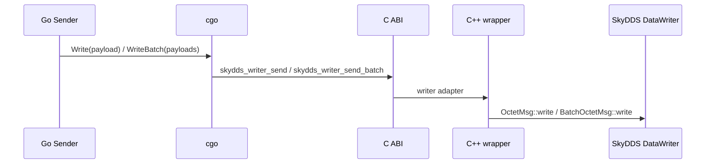
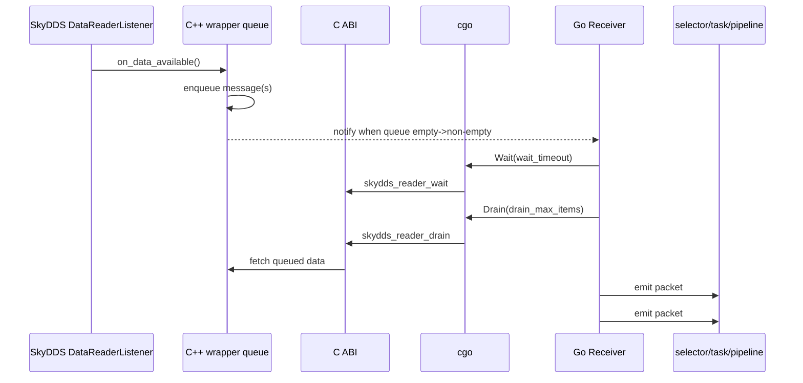

# SkyDDS 接入说明（dds_skydds）

## 1. 设计边界

- 保持主链路不变：`receiver -> selector -> task -> pipeline -> sender`。
- SkyDDS 作为“轻量字节消息桥接”协议接入，不改造成通用 DDS 框架。
- 当前支持两种消息模型：
  - `message_model=octet`（`Satellite::OctetMsg`）
  - `message_model=batch_octet`（`Satellite::BatchOctetMsg`）
- DDS 发现、QoS、传输、日志由 `dcps_config_file` 指向的 SkyDDS 配置文件控制。

## 2. 目录布局约定（固定）

- 安装包放置目录：`third_party/skydds/packages/`
- 解压后 SDK 目录：`third_party/skydds/sdk/`
- 安装包格式：当前仅支持 `*.tar.gz`

## 3. 与 PDF 的对应关系

读取文档：`docs/SkyDDS应用开发BatchOctetMsg快速指南（C++）.pdf`。

实现对应：

- 参考 PDF 的 IDL：`OctetMsg` 与 `BatchOctetMsg`。
- sender 侧在 `batch_octet` 下按阈值聚合，再一次写入 `BatchOctetMsg`。
- receiver 侧在 `batch_octet` 下读取 `BatchOctetMsg`，拆成多条独立 payload 后逐条下发。
- C++ 使用 `DomainParticipant/Topic/Publisher|Subscriber/DataWriter|DataReader`；Go 仅通过 C ABI 调用。

## 4. Go / cgo / C ABI / C++ / SkyDDS SDK 调用链

### 4.1 分层关系

- Go sender/receiver（`src/sender/skydds.go`、`src/receiver/skydds.go`）负责业务语义：
  - sender 负责 `octet` 直发与 `batch_octet` 聚合；
  - receiver 负责 `Wait(timeout)` + `Drain(maxItems)` 后逐条 packet 下发。
- cgo 层（`src/skydds/skydds_cgo.go`）负责 Go 与 C ABI 的参数/内存边界转换。
- C ABI（`src/skydds/skydds_bridge.h`）提供稳定的 C 接口给 cgo 调用。
- C++ wrapper（`src/skydds/skydds_bridge.cpp`）负责真正调用 SkyDDS SDK：
  - writer 路径调用 SkyDDS `DataWriter`；
  - reader 路径由 SkyDDS `DataReader` listener 收包、入本地队列并发通知。

### 4.2 sender 时序（octet / batch_octet）



- `message_model=octet`：每次 `Send` 调一次单条写接口。
- `message_model=batch_octet`：Go 先按 `batch_num/batch_size/batch_delay` 聚合，再一次批量写接口。

### 4.3 receiver 时序（通知唤醒 + 批量拉取 + 逐条下发）



补充说明：

- 批量拉取的目的仅是减少 Go/C++ 边界往返，不改变 runtime 内部“单条 packet”语义。
- `batch_octet` 在进入 runtime 前会拆成子消息并逐条下发，`octet` 同样逐条下发。
- 主数据面不采用“纯忙轮询”，也不采用“每条消息 direct callback Go”。

## 5. sender 聚合语义（batch_octet）

当 sender 使用 `message_model=batch_octet`：

- 聚合阈值参数：
  - `batch_num`：单批最大消息数
  - `batch_size`：单批 payload 总字节阈值（统计口径为 payload 长度之和，不含协议包装开销）
  - `batch_delay`：首条入批后最长等待时长
- 任一阈值触发即 flush。
- 若单条消息超过 `batch_size` 且当前缓冲为空：该消息会“单条成批”直接发送。
- `Close()` 时会强制 flush 残留批次。
- flush 失败会记录错误日志，并在定时 flush 场景下恢复缓冲以便重试。

## 6. receiver 接收模型（通知唤醒 + 批量拉取）

`dds_skydds` receiver 当前采用：

- C/C++ listener 收到数据后，先入本地队列；
- 队列从空变非空时触发通知，Go 侧被唤醒；
- Go 侧收到通知后执行一次 `drain`，尽量拉取当前可用数据，减少 Go/C++ 边界往返；
- `drain` 结果中的每条消息都必须逐条形成独立 packet，逐条进入既有主链路：
  `receiver -> selector -> task -> pipeline -> sender`。

说明：

- **不采用纯忙轮询** 作为主方案；
- **不采用每条消息 direct callback Go 处理数据面** 作为主方案；
- 批量拉取仅用于减少跨语言边界调用次数，不改变 runtime 内部单条 packet 语义。

### 6.1 receiver 可配置参数（仅 `type=dds_skydds`）

- `wait_timeout`（duration，默认 `500ms`）
  - 作用：控制 Go 侧 `Wait(timeout)` 的等待时长。
  - 要求：必须是合法且 `>0` 的 duration（例如 `1ms`、`5ms`、`100us`、`20ms`）。
- `drain_max_items`（int，默认 `2048`）
  - 作用：控制 Go 侧每次 `Drain(maxItems)` 的单次拉取上限。
  - 要求：必须是 `>0` 的整数。
- `drain_buffer_bytes`（int，默认 `4194304`）
  - 作用：控制 Go 侧每次 `Drain()` 接收 C/C++ 批量数据时的总缓冲区大小（字节）。
  - 要求：必须是 `>0` 的整数。

这三个参数只影响 receiver 内部“通知唤醒 + 批量拉取”的实现细节，不改变 sender、selector、pipeline 语义，也不改变“逐条 packet 下发”语义。

## 7. receiver 拆批语义（batch_octet）

当 receiver 使用 `message_model=batch_octet`：

- 每次读取一个 `BatchOctetMsg`。
- 按 `batchData` 原顺序逐条拆成独立 packet，并逐条进入 selector/task/pipeline。
- 空子消息会告警并跳过，不会把整批直接作为单个 packet 下发。

## 8. 环境变量

```bash
source scripts/skydds/env.sh
```

导出：`SKY_DDS`、`DDS_ROOT`、`ACE_ROOT`、`TAO_ROOT`、`LD_LIBRARY_PATH`。

## 9. 构建方式

```bash
CGO_ENABLED=1 go build -tags skydds -o bin/forward-stub .
```

不加 `-tags skydds` 时，SkyDDS 走 stub，不影响其他协议。

如需离线导入基础镜像，请使用 `deploy/images/forward-stub-base-bookworm.tar.gz`，并参考：`deploy/docker/README.md`。
当前 `deploy/docker` 主线默认目标架构为 `aarch64`，在 Docker / Buildx 中对应 `linux/arm64`。

如需在镜像构建阶段自动完成 `packages -> sdk` 解压并编译 SkyDDS 版本服务，可使用：

```bash
./deploy/docker/build-and-save-skydds-runtime-bookworm.sh
```

## 10. 运行方式

- Octet 示例：`configs/skydds.business.example.json`
- Batch 示例：`configs/skydds-batch.business.example.json`

## 11. 测试脚本

- `scripts/skydds/setup_linux.sh`
- `scripts/skydds/env.sh`
- `scripts/skydds/test_sender.sh`
- `scripts/skydds/test_receiver.sh`
- `scripts/skydds/test_loop.sh`

## 12. 无 SDK 环境下的 mock 验证

在本地没有 SkyDDS SDK（未配置 `third_party/skydds/sdk`，也不链接真实动态库）时，可直接运行 Go 单元测试验证当前 Go 层逻辑：

- sender：`octet` 单条写出、`batch_octet` 按 `batch_num/batch_size/batch_delay/close` flush、顺序与超大单条行为。
- receiver：通知唤醒 + 批量 drain、`octet` 多轮 drain、`batch_octet` 拆子消息后逐条 packet 下发、`wait_timeout` / `drain_max_items` / `drain_buffer_bytes` 参数接入。

注意：mock 测试只验证 Go 层行为与边界语义，不等同于真实 SkyDDS SDK 联调（cgo/C/C++/DDS 运行时）。

## 13. 已知限制

- 需要本地 SDK 中提供 `SatelliteTypeSupportImpl.h / libSatelliteCommon`。
- 当前批量实现优先正确性与可维护性，尚未做性能优化结论。
