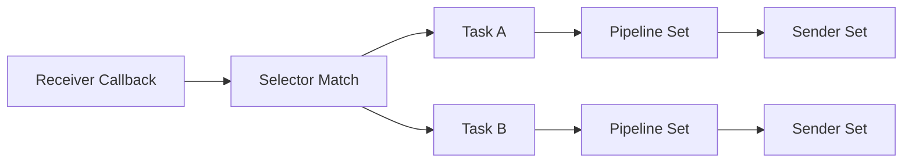

# Task and Dispatch

> 架构基线：`receiver -> selector -> task -> pipelines -> senders`。receiver 只负责收包，selector 返回 task 集，task 负责串行执行 pipelines 并在末端 fan-out 到 senders。

## 1. 文档目标

本文聚焦运行时最关键的编排路径：receiver 如何把数据送到 selector，selector 如何返回 task 集，task 如何执行 pipeline 并发送到 sender。

## 2. dispatch 职责

dispatch 位于 receiver 回调之后，负责：

- 根据 receiver 名字查找 selector dispatch 快照。
- 解析 `packet.Meta.Remote`，优先走精确 IP / 端口快路径，再补充 CIDR / 端口范围匹配。
- 先合并命中的 source selector task 集；若全部 miss，再回退到 default selector，并复用现有 fan-out 语义。

设计关键点：

- `dispatchSubs` 为只读快照，读路径无锁。
- 单订阅复用原 packet，减少复制。

对应实现位置：

- `runtime.dispatch`
- `Store.matchDispatchTasks`
- `Store.getRecvPayloadLogOption`

## 3. task 职责

task 负责一条完整链路：

- 选择执行模型。
- 顺序执行 pipeline。
- fanout 到 sender 列表。
- 维护 in-flight 计数与优雅停机。

对应实现位置：

- `Task.Start`
- `Task.Handle`
- `Task.processAndSend`
- `Task.StopGraceful`

## 4. 实例化关系

- 一个 receiver 可以绑定多个 selector，但最多只有一个 default selector。
- 一个 selector 命中后可返回多个 task。
- default selector 只在该 receiver 的 source selector 全部未命中时生效。
- 一个 task 可绑定多个 pipeline 和 sender。
- 一个 sender 可以被多个 task 引用。

## 5. 调度路径图

## 6. 队列缓冲回压机制

- `pool` 模型：ants 池 + `queue_size`。
- `channel` 模型：`channel_queue_size` 有界队列。
- `fastpath` 模型：无额外队列，回压直接作用到上游调用链。

当队列满时，task 会丢包并记录错误日志。

关键参数来源：

- task 显式配置字段。
- system `business_defaults.task`。
- `ApplyDefaults` 的内置默认值。

## 7. 快照与热更新

更新时 runtime 会重建 dispatch 快照：

1. 编译 selector 规则到 receiver 维度的 dispatch state。
2. 生成 `map receiver to selector dispatch state`。
3. 原子替换为新快照。

优点：

- 分发路径无需持锁。
- 切换过程边界清晰。

## 8. 关键维护点

- 新增 task 时优先检查 selector/task/sender 引用正确性。
- route stage 场景需确保 sender 名称一致。
- 长期堆积时优先检查下游 sender 性能和 task 队列参数。

## 9. 调度问题快速判断

1. 若单 receiver 下 selector 命中大量 task 且吞吐下降，优先检查 clone 成本与 sender 压力。
2. 若仅 pool 模型报警，优先检查 `queue_size` 与 `pool_size` 配比。
3. 若仅 channel 模型报警，优先检查顺序链路是否超出单 worker 承载上限。
