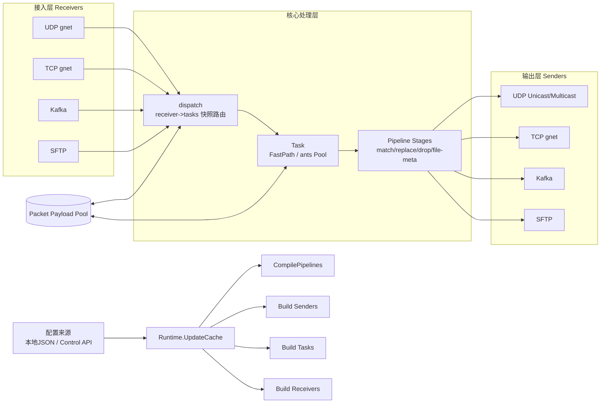
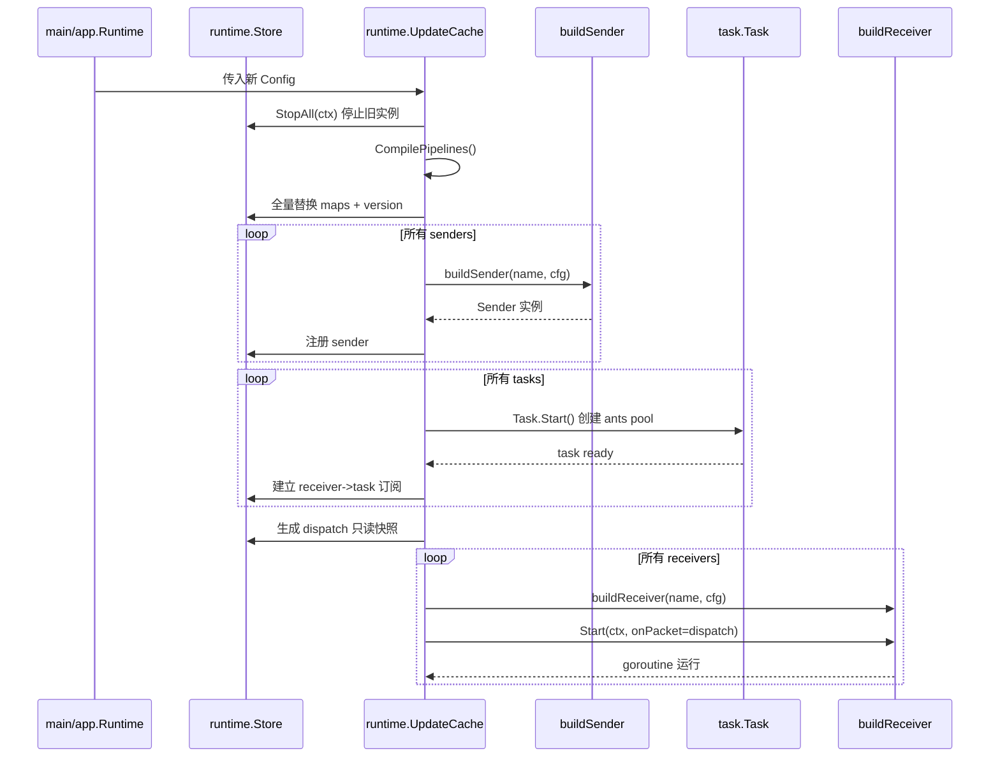
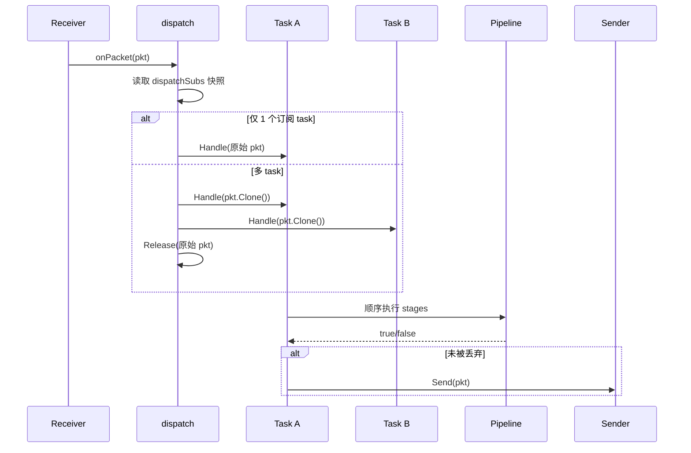
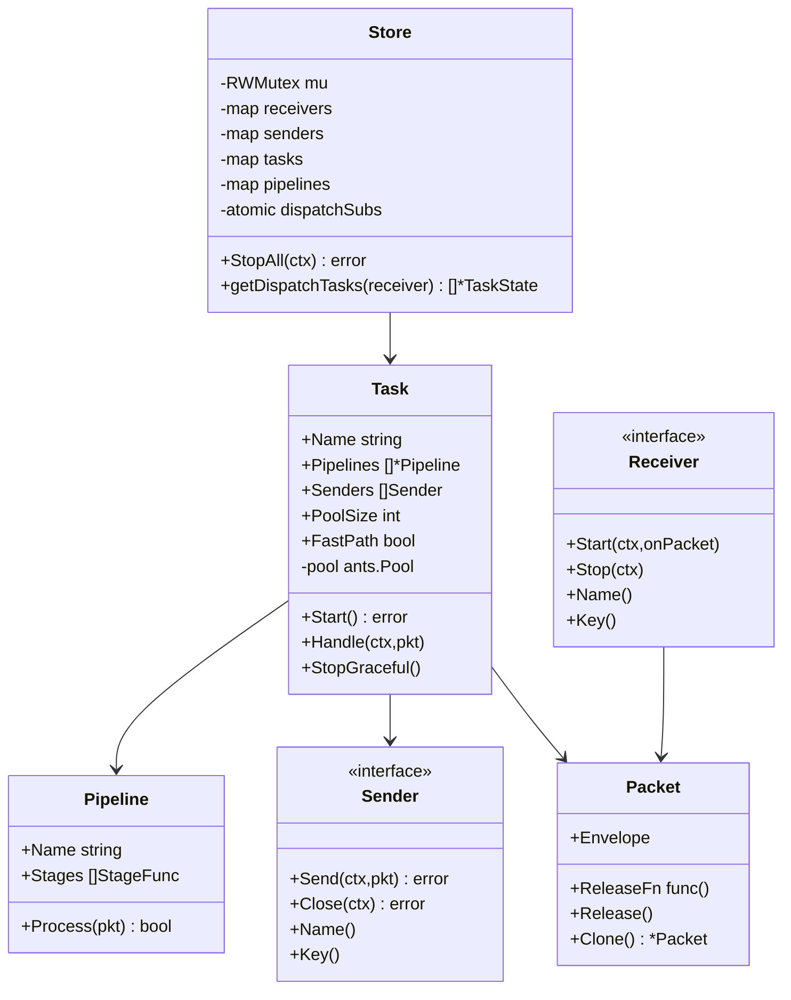
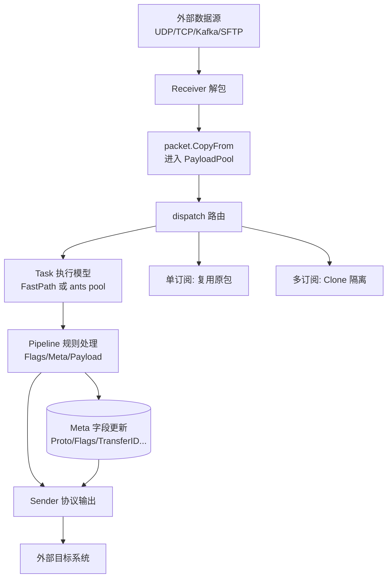
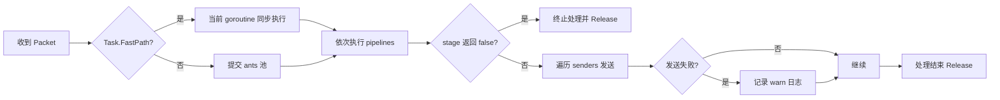

# forward-stub 技术架构与实现说明

> 本文面向开发、运维和架构评审，系统性说明 `forward-stub` 的模块边界、运行机制、关键特性，以及为何该项目具备高吞吐、高可扩展、高可用的工程特征。

## 1. 项目定位与目标

`forward-stub` 是一个 Go 实现的高吞吐报文转发引擎，支持多协议接入、可编排处理、以及多协议输出：

- **接收端（Receiver）**：`udp_gnet` / `tcp_gnet` / `kafka` / `sftp`
- **处理层（Pipeline）**：可组合的 stage 链
- **发送端（Sender）**：`udp_unicast` / `udp_multicast` / `tcp_gnet` / `kafka` / `sftp`
- **编排层（Task）**：将 receiver、pipeline、sender 绑定成业务链路
- **运行时（Runtime/Store）**：统一管理生命周期、热更新、订阅分发

该定位可覆盖“协议转换”“流量复制”“规则过滤”“文件分块转发”等典型集成场景。

---

## 2. 总体架构图（Architecture Diagram）

---

## 3. 核心时序图（Sequence Diagram）

### 3.1 启动与全量热更新时序

### 3.2 单包处理时序（多订阅 fan-out）

---

## 4. 类图（Class Diagram）

---

## 5. 数据流图（Data Flow Diagram）

---

## 6. 数据处理流程图（Data Process Flow）

---

## 7. 关键特性详解

## 7.1 多协议接入与输出

- 通过 `buildReceiver` / `buildSender` 按配置实例化具体协议组件，形成“插件式”拓扑。
- TCP 支持可选 `u16be` 分帧，Kafka/SFTP 支持专有参数，满足异构系统互联。
- 统一 `packet.Packet` 结构承载跨协议数据和元信息，避免协议耦合扩散到业务处理层。

## 7.2 Pipeline 可编排规则引擎

当前支持 stage：

- `match_offset_bytes`
- `replace_offset_bytes`
- `drop_if_flag`
- `mark_as_file_chunk`
- `clear_file_meta`

通过 `CompilePipelines` 在配置加载时编译，运行期直接执行函数链，减少解释开销。

## 7.3 可控并发模型

`Task` 提供两种执行路径：

- **FastPath**：同步执行，极低调度开销，适合轻量规则/低延迟场景。
- **Worker Pool**：基于 `ants`，启用 `WithNonblocking(true)` + `WithPreAlloc(true)`，在高压场景限制资源并减少抖动。

## 7.4 统一生命周期与全量热更新

`UpdateCache` 采用“先停旧、后建新、再启动入口”的全量替换策略：

1. 先 `StopAll` 清理旧 runtime
2. 编译 pipeline
3. 重建 sender/task/receiver
4. 先生成 dispatch 快照，再启动 receivers

该顺序确保“拓扑完整后再放流量”，降低更新窗口风险。

## 7.5 可观测性

- 结构化日志（zap）
- Receiver/Task 方向流量聚合统计
- Payload 日志支持全局 + task 白名单 + 字节截断
- Task 暴露运行态统计（inflight、pool running/free/waiting）

---

## 8. 为什么吞吐量高

## 8.1 事件驱动网络栈

UDP/TCP 核心链路基于 `gnet` 事件循环，配合 `multicore`、`num_event_loop`、`read_buffer_cap` 可调，实现更高 IO 吞吐能力。

## 8.2 热路径优化

- `dispatchSubs` 使用 `atomic.Value` 持有只读快照，分发路径无锁读取。
- 单订阅场景直接复用 packet，避免不必要 clone。
- 多订阅场景才 clone，按需付费。

## 8.3 内存复用

`packet.CopyFrom` 基于 `bytebufferpool` 管理 payload 缓冲，显著降低高频分配/GC 压力。

## 8.4 并发与背压策略

- Task 池满时 nonblocking 立即返回，避免全链路阻塞扩散。
- 可按 task 粒度调节 `pool_size`/`fast_path`，实现业务隔离与资源治理。

## 8.5 基准测试支撑

仓库内置压测入口（`cmd/bench`）和多组 benchmark（dispatch matrix、payload log 开关吞吐），可用于持续验证性能回归。

---

## 9. 为什么可扩展性高

## 9.1 组件解耦

- receiver / pipeline / sender / task 职责清晰。
- 协议扩展只需实现对应接口并在构建工厂注册。

## 9.2 配置驱动拓扑

新增链路通常只需要改配置（新增 receiver/sender/pipeline/task），无需改主流程代码。

## 9.3 Pipeline Stage 可增量扩展

新增规则类型只需在 `compileStage` 增加 case，并提供 StageFunc 实现，不影响现有 stage。

## 9.4 部署扩展友好

项目提供 Docker 多阶段构建与 Kubernetes 部署清单，可横向扩容实例并结合上游负载分流。

---

## 10. 为什么可用性强

## 10.1 生命周期管理稳健

`StopAll` 采用快照后并发关闭 receiver/sender，task 采用 graceful wait in-flight，兼顾停机速度和数据完整性。

## 10.2 更新策略简单可靠

全量替换避免差量更新带来的状态漂移和复杂回滚路径；在高可靠优先场景更易审计与运维。

## 10.3 容错与降级行为明确

- sender 发送失败仅影响当前发送动作，记录告警，不阻塞其他 sender。
- worker pool 满载时可控丢弃（有日志），保护系统整体稳定。

## 10.4 可观测与排障友好

流量统计 + payload 摘要 + 任务运行态指标，便于快速定位“入口拥塞、规则丢弃、出口失败”等问题。

---

## 11. 模块映射速查

- **入口启动**：`main.go`、`src/app/runtime.go`
- **配置定义与校验**：`src/config/*`
- **运行时编排**：`src/runtime/update_cache.go`、`src/runtime/store.go`、`src/runtime/compiler.go`
- **任务执行**：`src/task/task.go`
- **协议接入/输出**：`src/receiver/*`、`src/sender/*`
- **数据载体与内存池**：`src/packet/*`
- **压测与性能验证**：`cmd/bench/main.go`、`src/runtime/*benchmark_test.go`

---

## 12. 落地建议（用于生产）

1. **先压测后上线**：按业务包长和协议组合运行 `cmd/bench` 做容量基线。
2. **按任务隔离资源**：关键任务使用独立 sender、合理 `pool_size`，避免噪声互扰。
3. **渐进开启 payload 日志**：仅在问题排查时按任务白名单开启，并限制 `payload_log_max_bytes`。
4. **K8s 结合探针与滚动发布**：利用全量替换更新策略，降低热更新复杂度。

